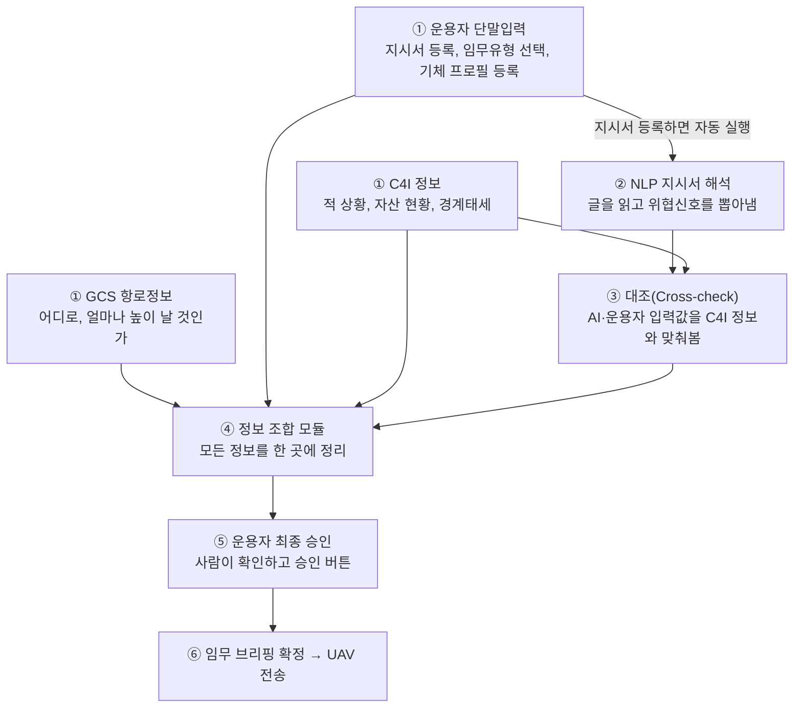

## 이 문서는 무엇을 다루나

지상통제센터 AI는 UAV가 뜨기 전에, 여러 곳에서 흩어져 들어오는 정보를 모아서 하나의 "임무 브리핑(mission_brief)"으로 정리하고, 사람(운용자)이 최종 확인한 뒤 UAV에 전달하는 역할을 합니다. 이 문서는 그 "정보를 모으고 정리하는 과정" 자체를 처음 보는 사람도 이해할 수 있도록 풀어서 설명합니다. 더 압축된 기술 문서는 `지상통제센터_AI_정보조합_아키텍처.md`를, 필드·타입 단위의 정식 스펙은 `B-1. 지상통제센터 AI 세부`를 참고하세요 — 이 문서는 한글 서술 위주로만 씁니다.

이제 mission_brief의 임무정보는 팀이 확정한 공식 METT+TC 상태 모델(단일 출처 스키마)을 그대로 따릅니다. 아래 설명도 이 구조를 기준으로 갱신했습니다.

## 핵심 아이디어 한 줄로

**AI는 판단 재료를 더 정확하게 만들어줄 뿐, 최종 결정은 항상 사람이 합니다.** NLP(문서를 읽는 AI)가 지시서를 해석해서 "이 위협은 이 정도로 심각해 보입니다"라는 후보안을 내놓지만, 그게 실제로 반영되려면 반드시 운용자가 확인하고 승인해야 합니다. 이 원칙이 아래 모든 단계 설계에 깔려 있습니다.

## 전체 흐름

세 소스(GCS·운용자·C4I)는 여전히 논리적으로 구분되지만, 실제로 시스템에 들어오는 관문은 GCS의 입력 창구 하나로 통일돼 있습니다 — C4I가 자동으로 준 정보든, 운용자가 직접 입력한 정보든, 결국 운용자가 GCS에서 임무를 등록하는 한 번의 행위(set_mission)로 시스템에 반영됩니다. "어디서 왔는가"와 "어떻게 들어오는가"를 구분해서 이해하면 됩니다.

## ① 정보 수집 — 세 군데서 동시에 모입니다

지상통제센터 AI에 정보를 주는 곳은 서로 관계없는 세 시스템입니다. 한 곳이 끝나야 다음 곳이 시작되는 게 아니라, 세 곳이 동시에 각자 준비되는 대로 정보를 보냅니다. 이렇게 하는 이유는 단순합니다 — 실제로도 이 세 시스템은 서로 다른 조직·장비가 운영하기 때문에, 서로를 기다릴 이유가 없습니다.

**GCS 항로정보**는 UAV가 실제로 날아갈 길입니다. 이륙지점, 목표지점(감시할 위치), 그리고 그 사이를 잇는 경유점들로 구성됩니다. 이 길은 GCS가 자기 데이터베이스(금지구역, 고도제한, 미리 조사해둔 지형고도)와 C4I가 준 작전지역 초안을 합쳐서 GCS 스스로 완성한 값입니다. 복귀지점도 이제 단일 지점이 아니라, 원기지·전진기지·비상착륙점처럼 여러 후보 기지 목록으로 관리됩니다 — 배터리·상황에 따라 어느 기지로 복귀할지 판단할 여지를 남겨두기 위해서입니다. 지상통제센터 AI 입장에서는 이미 다 정해진 길과 기지 목록을 그대로 받기만 하면 됩니다.

**운용자 단말입력**은 사람이 직접 넣는 정보입니다. 부대에서 내려온 지시서(METT+TC 문서, "이번 임무는 이렇다"는 공식 문서)를 GCS에 등록하고, 이번 비행이 정찰인지 감시인지 같은 임무유형을 고릅니다. 또한 임무 시작 시점에 "기체 프로필"도 함께 등록합니다 — 이번에 띄우는 기체가 어떤 종류인지, 정격 체공시간은 얼마인지, 예비기체를 갖고 있는지, 어떤 무장·센서를 탑재했는지 같은 정보입니다. 기체 프로필은 임무 동안 계속 바뀌는 임무정보와 성격이 달라서 따로 관리합니다 — 기체 스펙은 임무 시작 시 한 번 정해지면 비행 중에 바뀌지 않는 상수인 반면, 임무정보는 상황에 따라 계속 갱신되는 변수이기 때문입니다.

예비기체 보유 여부는 운용자가 기체 프로필에 직접 등록하지만, 사람이 手동으로 입력하는 값이라 실수가 있을 수 있습니다. 그래서 이 값도 등록되는 순간 C4I의 자산관리체계 자동 데이터와 대조해서, 서로 다르면 운용자에게 알려줍니다 — "출처가 운용자 입력"이라는 게 "다른 데이터로 검증하면 안 된다"는 뜻은 아니기 때문입니다.

운용자는 지시서를 등록할 때 "임무 가치 가중치"도 함께 설정합니다. 은닉성·생존성·정보가치·적시성, 이 네 가지를 각각 얼마나 중요하게 볼지 사람이 직접 숫자로 정하는 겁니다. 이건 이 시스템이 처음부터 갖고 있던 철학 — "최적은 생존이 아니라 임무 성공에 대한 기여도로 정의된다" — 을 구체적인 숫자로 못박은 부분입니다. 같은 상황이라도 이 가중치가 다르면 위험평가와 대응 판단의 결론이 달라집니다.

**C4I 정보**는 상급 지휘체계에서 자동으로 흘러들어오는 정보입니다. 적이 어떤 활동을 하는지(적상황), 부대의 경계태세가 어느 수준인지, 예비기체 현황(자산관리체계), 민간 밀집도 초안 등이 여기 포함됩니다.

## ② NLP 지시서 해석 — 글을 읽고 신호로 바꿔줍니다

운용자가 지시서를 등록하는 순간, 백그라운드에서 NLP(자연어를 이해하는 AI)가 그 글을 읽기 시작합니다. 예를 들어 지시서에 "가용 예비기체 없음. 손실 시 재보급까지 72시간 소요"라는 문장이 있으면, NLP는 이걸 "이 위협이 실제로 일어난다면 그 심각도를 한 단계 더 위로 올려야 한다"는 신호로 바꿔줍니다.

여기서 중요한 설계 원칙 하나: **NLP는 지시서 원문만 읽습니다.** C4I나 GCS가 준 다른 정보는 보지 않습니다. 왜냐하면 AI가 여러 데이터를 한꺼번에 뒤섞어서 판단하기 시작하면, 나중에 "왜 이런 결과가 나왔는지" 사람이 추적하기 어려워지기 때문입니다. 대신 "여러 정보를 종합해서 보는 것"은 다음 단계(③ 대조)에서, 계산식이 명확한 방식으로 따로 처리합니다.

NLP가 얼마나 확신하는지는 숫자(confidence)로 나옵니다. "확인됨"처럼 단정적인 표현이면 확신도가 높게, "가능성 있음"처럼 애매한 표현이면 확신도가 낮게 잡힙니다. 확신도가 낮은 신호(0.7 미만)는 아예 사람에게 보여주지도 않습니다 — 확실하지 않은 걸 굳이 승인받으라고 하면 오히려 혼란만 주기 때문입니다.

## ③ 대조(Cross-check) — AI·운용자 입력을 사실과 맞춰봅니다

이 단계는 두 종류의 대조를 합니다. 하나는 NLP가 지시서에서 뽑아낸 신호를 C4I의 실제 데이터와 비교하는 것이고, 다른 하나는 운용자가 직접 등록한 값(기체 프로필 등)을 C4I 자동 데이터와 비교하는 것입니다. 둘 다 일종의 팩트체크입니다.

예를 들어 지시서에 "적 저격조 첩보 확인됨"이라고 써 있는데, C4I의 적상황 정보에도 같은 내용이 독립적으로 잡혀 있다면 — 두 군데서 같은 얘기가 나온 셈이니 신뢰도를 더 올려줍니다. 승인 화면에는 "왜 이 확신도로 바뀌었는지" 이유가 라벨로 같이 표시됩니다.

일부 항목은 확신도를 조정하는 대신 "일치/불일치" 경고만 보여줍니다. 지시서의 "임무목적"(어떤 작전을 하려는지)을 운용자가 고른 임무유형이나 C4I가 아는 임무와 비교하는 경우, 그리고 운용자가 등록한 기체 프로필의 예비기체 보유여부를 C4I 자산관리체계 데이터와 비교하는 경우가 여기 해당합니다. 이런 항목은 "얼마나 위험한가" 같은 확률 문제가 아니라 "맞다/틀리다" 같은 사실 확인 문제라서, 확신도를 올리고 내리는 방식이 안 맞기 때문입니다.

| 대조 대상 | 무엇과 비교하나 | 결과 처리 |
|---|---|---|
| 지시서의 적 활동 관련 위협 신호(NLP 추출) | C4I 적상황 정보 | 확신도 자동 조정 + 이유 표시 |
| 지시서의 무기·화력 관련 심각도 신호(NLP 추출) | C4I 적상황 정보 | 확신도 자동 조정 + 이유 표시 |
| 지시서의 예비기체·재보급 관련 심각도 신호(NLP 추출) | 기체 프로필의 예비기체 보유여부 | 확신도 자동 조정 + 이유 표시 |
| 지시서의 민간 지역 관련 신호(NLP 추출) | C4I 민간 밀집도 초안 | 확신도 자동 조정 + 이유 표시 |
| 지시서의 임무목적(NLP 추출) | 운용자가 고른 임무유형, C4I의 임무 정보 | 불일치 시 경고만 (확신도 조정 없음) |
| 기체 프로필의 예비기체 보유여부(운용자 등록) | C4I 자산관리체계 자동 데이터 | 불일치 시 경고만 (확신도 조정 없음, 등록값 검증용) |

GCS 항로정보(경로)는 이 대조표에 없습니다. 지시서 문장이 특정 지리적 위치를 콕 집어 언급하지 않는 이상, 비교할 대상이 마땅치 않기 때문입니다.

## ④ 정보 조합 모듈 — 한 곳에 모아 정리합니다

이제 GCS 항로정보, 운용자가 넣은 정보(지시서, 임무유형, 기체 프로필, 가중치), C4I 정보, 그리고 대조까지 끝난 NLP 신호, 이 네 가지를 하나로 묶습니다. 이때 뒤죽박죽 섞지 않고, "이건 GCS에서 왔다", "이건 C4I에서 왔다"처럼 출처별로 묶어서 정리합니다. 기체 프로필은 임무정보와 따로, 최상위에 별도로 둡니다 — 상수와 변수를 섞지 않는다는 원칙 그대로입니다. 나중에 사람이 확인할 때 "이 값이 어디서 왔는지" 바로 알 수 있게 하기 위해서입니다.

## ⑤ 운용자 최종 승인 — 사람이 마지막으로 확인합니다

승인은 두 가지로 나뉩니다.

하나는 수집된 정보 전체를 소스별로 요약한 체크리스트를 보고 확인하는 것이고, 다른 하나는 NLP가 제안한 위협 신호들을 카드 형태로 하나하나 확인하는 것입니다. 카드에는 원래 지시서 문장, NLP의 해석, 확신도, 그리고 대조 단계에서 왜 그 확신도가 나왔는지까지 다 표시됩니다. 이번 설계에서는 승인 버튼만 다루고, 거부하거나 다시 수집을 요청하는 흐름은 범위 밖으로 뒀습니다 — 나중에 더 정교하게 다듬을 부분입니다.

## ⑥ 임무 브리핑 확정 · UAV 전송

승인이 끝나면 이 시점의 정보 전체가 "임무 브리핑(mission_brief)"이라는 이름으로 확정되고, 시간이 기록된 뒤 UAV로 전송됩니다. UAV는 이걸 들고 비행을 시작합니다.

참고로, 임무가 끝난 뒤 실제로 무슨 일이 있었는지는 별도의 학습 파이프라인(RAG 코퍼스 축적)으로 흘러가서, 다음 임무 때 NLP가 확신도를 판단하는 데 참고자료로 쓰입니다. 이 부분은 이 문서의 범위 밖이며 별도 문서에서 다룹니다.

## 예시로 보기

같은 시나리오(OO여단 정찰중대, "기러기" 작전지역, 예비기체 없음)를 예로 들면 이렇습니다. GCS는 이륙지점과 목표지점, 그 사이 경유점을 담은 항로를 보내고, 운용자는 "적 저격조 및 대구경화기 첩보 확인됨", "가용 예비기체 없음" 같은 문장이 담긴 지시서를 등록하며, 동시에 기체 프로필(정격 체공시간, 예비기체 없음, 탑재 센서 구성)과 임무 가치 가중치(이번엔 생존성보다 정보가치를 더 중요하게)도 함께 등록합니다. C4I는 같은 적 첩보를 독립적으로 자동 전송합니다. NLP가 지시서에서 위협 신호를 뽑아내면, 대조 단계가 C4I의 적 첩보와 겹치는 걸 확인해 확신도를 올리고, 동시에 운용자가 등록한 "예비기체 없음"도 C4I 자산관리체계 기록과 일치하는지 확인합니다. 운용자는 이 신호들이 담긴 카드를 확인한 뒤 승인합니다. 이렇게 확정된 임무 브리핑이 UAV로 전달됩니다.
