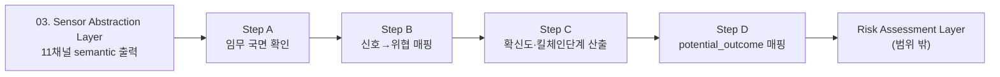

`03. Sensor Abstraction Layer`의 11채널 semantic 출력을 입력으로 받아, "지금 어떤 위협이 있고 얼마나 확실한지, 어느 단계까지 진행됐는지"를 판정해서 Risk Assessment Layer로 넘기는 계층입니다. L×S 위험도 계산이나 자동대응 로직은 이 문서 범위 밖입니다(Risk Assessment Layer·Response Layer에서 다룸).

Step A(임무 국면 확인) → B(신호→위협 매핑) → C(확신도·킬체인단계 산출) → D(potential_outcome 매핑) 순서로 처리됩니다. 전부 결정론적 룰·테이블 조회이고, Step C에만 CPU 기반 통계기법(로그오즈 결합)으로 confidence를 더 정교하게 뽑는 보조 경로가 병렬로 붙습니다 — GPU를 쓰는 신경망은 아닙니다. `03. Sensor Abstraction Layer`에서 이미 YOLOv8n·MobileNetV3-small이 GPU를 상시 점유하고 있어서, 이 레이어는 GPU 자원을 추가로 요구하지 않는 방식으로 설계했습니다.



---

## Step A — 임무 국면 확인

`mission_phase` 채널(`03. Sensor Abstraction Layer`)에서 이미 계산된 `declared`(현재 임무단계)와 `mission_phase_confidence`(국면 판정 확신도)를 그대로 읽습니다. 재계산하지 않습니다 — 국면 판정 로직은 `03. Sensor Abstraction Layer` 소관이고, `04. Threat Modeling`은 그 결과를 신뢰해서 소비합니다.

국면은 위협 후보를 걸러내지 않고, Step C에서 계산된 confidence에 배수를 곱하는 방식으로만 반영됩니다(하드 필터링이 아닌 소프트 조정 — 특정 국면에서 위협을 아예 배제했다가 실제로 그 위협이 발생하면 놓칠 위험이 있기 때문입니다).

| 국면(phase) | 위협(threat) | 배수 | 사유 |
|---|---|---|---|
| LOITER_ROI | T3 | 1.1 | 정찰중 정지상태 → 근접소화기 위협 약간 상향 |
| LOITER_ROI | T7 | 0.9 | 정찰중 보통 안전고도 유지 → 지형충돌 위협 약간 하향 |
| LOITER_ROI | T4 | 1.1 | 정지상태 → 포획 시도에 취약 |
| RTL | T3 | 0.9 | 이탈 중 → 근접위협 약간 하향 |
| LAND | T7 | 1.2 | 착륙접근 저고도·지형근접 → 지형충돌 위협 가장 상향 |
| LAND | T4 | 1.2 | 저속·저고도 → 포획 시도에 가장 취약 |
| TAKEOFF | T7 | 1.1 | 이륙 직후 저고도 → 지형충돌 위협 소폭 상향 |
| TAKEOFF | T4 | 1.1 | 저속 구간 → 포획 시도에 취약 |
| *(그 외 조합)* | | 1.0 | 배수 없음(T1·T2·T5는 국면과 무관한 위협으로 설계 — 전 국면 1.0이 의도된 값, 빈칸 아님) |

`declared` 값의 종류(TAKEOFF/WAYPOINT/LOITER_ROI/RTL/LAND)는 `A-1. 추상 결과 세부 내용`에 정의된 taxonomy를 그대로 씁니다.

---

## Step B — 신호 → 위협 매핑

`03. Sensor Abstraction Layer`의 11개 채널 중 `state=anomaly`이거나 임계값을 넘는 값만 골라, 미리 정해둔 채널→위협 매핑표에 대조합니다. 정상 신호는 애초에 어떤 위협에도 매핑되지 않으므로, 이상신호만 골라내는 게 1차 필터 역할을 합니다.

### 위협 카탈로그

| ID | 위협 | 이번 라운드 상태 |
|---|---|---|
| T1 | EW/GPS 스푸핑 | 매핑 확정 |
| T2 | 사이버/C2 하이재킹 | 매핑 확정 |
| T3 | 근접 소화기 | 매핑 확정 |
| T4 | 물리 포획 | 매핑 확정 (다중채널 조합) |
| T5 | 레이저 | 매핑 확정 (quality_delta 파생필드 사용) |
| T6 | 환경노출도(배경) | threat_event 아님 — 별도 트랙(아래) |
| T7 | 지형충돌/CFIT | 매핑 확정 |

### 신호 → 위협 매핑표

| 채널 | 조건 | 위협 | 데이터 출처 (채널 → 원시 센서) |
|---|---|---|---|
| proximity_object | `state=anomaly` AND `payload.weapon_shape=True` | T3 | proximity_object(`03. Sensor Abstraction Layer`) ← 카메라 raw 프레임, YOLOv8n+MobileNetV3-small (`02. UAV Sensor Layer`: 1.영상 정보) |
| acoustic_event | `payload.event_type="gunshot"` | T3 | acoustic_event(`03. Sensor Abstraction Layer`) ← 마이크 raw 파형 (`02. UAV Sensor Layer`: 6.음향 정보) |
| position_consistency | `payload.gps_imu_residual_m > 5.0` | T1 | position_consistency(`03. Sensor Abstraction Layer`) ← GPS+IMU+기압계 (`02. UAV Sensor Layer`: 2.항법 정보, 4.전자전 정보) |
| rf_spectrum | `payload.wideband_anomaly=True` | T1 | rf_spectrum(`03. Sensor Abstraction Layer`) ← 광대역 RF 수신기 스펙트럼 스캔 (`02. UAV Sensor Layer`: 4.전자전 정보) |
| link_integrity | `payload.checksum_fail_rate > 0.05` OR `payload.seq_gap_count > 0` | T2 | link_integrity(`03. Sensor Abstraction Layer`) ← C2 링크 프로토콜 시퀀스번호·체크섬 (`02. UAV Sensor Layer`: 3.통신 정보) |
| encryption_status | `payload.downgrade_detected=True` | T2 | encryption_status(`03. Sensor Abstraction Layer`) ← C2 링크 프로토콜 암호화모드 필드 (`02. UAV Sensor Layer`: 3.통신 정보) |
| obstacle_proximity | `payload.distance_m / payload.closure_rate_mps < 3.0` (초, 충돌예상시간 기준) | T7 | obstacle_proximity(`03. Sensor Abstraction Layer`) ← 레인지파인더/스테레오 거리값 (`02. UAV Sensor Layer`에 미명시, 하드웨어 확정 시 보완 필요) |
| proximity_object | `quality_delta < -0.3` | T5 | proximity_object(`03. Sensor Abstraction Layer`), quality_delta는 `A-1. 추상 결과 세부 내용` 신규 필드 |
| terrain_class | `quality_delta < -0.3` | T5 | terrain_class(`03. Sensor Abstraction Layer`), quality_delta는 `A-1. 추상 결과 세부 내용` 신규 필드 |

`checksum_fail_rate`(0.05)는 실측 이전 팀 설정값입니다(디지털 통신 통상 성능저하 관례치를 참고했으나 실제 하드웨어로 재조정 필요). obstacle_proximity의 임계값은 고정거리(10.0m) 대신 충돌예상시간(time-to-collision, 3.0초) 기준으로 바꿔서 기체 속도와 무관하게 물리적으로 일관된 판정이 되도록 했습니다.

### T4 — 다중채널 동시조건

단일 채널로는 오탐(단순 통행인, GPS 오차, 일시적 통신장애)과 구분이 안 돼서, 아래 세 조건이 **동시에** 참일 때만 매칭됩니다.

| 채널 | 조건 | 데이터 출처 |
|---|---|---|
| proximity_object | `payload.class ∈ {person, vehicle}` AND `payload.closing=True` | proximity_object(`03. Sensor Abstraction Layer`) ← 카메라 raw 프레임 (`02. UAV Sensor Layer`: 1.영상 정보) |
| mission_phase | `payload.match=False` (선언값-행동패턴 불일치) | mission_phase(`03. Sensor Abstraction Layer`) ← MISSION_CURRENT, 행동패턴 (`02. UAV Sensor Layer`: 2.항법 정보, 8.임무 상태) |
| link_status | `state ≠ normal` (통신 이상) | link_status(`03. Sensor Abstraction Layer`) ← C2 라디오 RSSI/SNR (`02. UAV Sensor Layer`: 3.통신 정보) |

세 조건 모두 만족 → T4(물리포획) 매칭.

### T6 — 환경노출도(배경): 별도 트랙

T6는 "이상 신호가 튀는 사건"이 아니라 "이 지형에 있으면 원래부터 노출 위험이 상시로 깔려있다"는 배경 위험도라, threat_event 후보에 넣지 않습니다. terrain_class 채널(`03. Sensor Abstraction Layer`)의 `exposure_score`(← GIS+카메라 세그멘테이션, `02. UAV Sensor Layer`: 1.영상 정보/7.환경 정보)를 가공 없이 `background_exposure_score`로 Step D 출력에 항상 포함시키고, confidence·kill_chain_stage 계산에는 넣지 않습니다.

### 탐지 범위 밖

T4·T5는 매핑이 확정됐지만, THREAT_CATALOG의 나머지 항목 중 앞으로 채널이 추가되면 매핑을 넓힐 수 있습니다. 지금 11개 채널로 커버되지 않는 위협 신호는 `01. 지상 정보 센터 AI`(`B-1. 지상통제센터 AI 세부`)의 사전 정보융합(C4I `enemy_situation`, NLP 지시서 해석)이 비행 전 위험판단으로 보완합니다.

---

## Step C — 확신도 · 킬체인 단계 산출

### 채널 가중치

채널마다 기본 가중치가 있고, 필요하면 `(채널, 위협)` 쌍으로 값을 다르게 줄 수 있는 구조입니다(지금 확정된 위협들은 전부 기본값만 씁니다). 이 값들은 팀이 정한 설계값이며, RAG 피드백 데이터가 쌓이면 재학습됩니다(아래 "AI 강화판" 참고).

| 채널 | 기본 가중치 |
|---|---|
| proximity_object | 0.40 |
| position_consistency | 0.35 |
| link_integrity | 0.35 |
| obstacle_proximity | 0.35 |
| encryption_status | 0.35 |
| acoustic_event | 0.30 |
| rf_spectrum | 0.25 |
| terrain_class | 0.25 |
| mission_phase | 0.25 |
| link_status | 0.15 |
| *(그 외 채널)* | 0.20 (기본값) |

### quality 기반 채널 제외

채널의 quality가 낮으면 그 채널을 "일치했다"고 카운트하지 않습니다. 두 가지 하한이 있습니다.

```
W_min = 0.20   # 구조적 하한 — base_weight가 이 밑이면 quality와 무관하게 항상 제외
Q_min = 0.65   # 열화 하한 — base_weight는 W_min을 넘지만, quality가 이 밑이면 이번 사이클만 제외

if base_weight(channel, threat) < W_min:
    항상 제외 (예: link_status — 보조 신호일 뿐 단독 근거가 될 수 없음)
elif quality(channel) < Q_min:
    이번 사이클만 제외 (열화 — 예: 안개로 proximity_object quality가 낮아진 경우)
else:
    match_count·confidence 계산에 포함
```

매칭된 채널이 전부 제외되면 그 threat_event는 이번 사이클 candidates에서 빠집니다(근거가 다 무너지면 낮은 확신도로 격하만 시키는 대신 미탐지로 처리 — 과신 방지).

### 결정론적 confidence

| 매칭된 채널 수 | confidence |
|---|---|
| 1 | 0.7 |
| 2 | 0.9 |
| 3 이상 | 0.95 |

`avg_weight` = 매칭된 채널들의 base_weight 평균. `kill_chain_stage`는 `avg_weight ≥ 0.35`이고 매칭 채널 2개 이상이면 "후기", 1개 이상이면 "중기", 없으면 "초기"로 판정합니다.

### AI 강화판 (병렬, CPU 전용)

같은 매칭 채널들을 로그오즈(logit) 결합으로 다시 계산해 더 정교한 연속값을 뽑습니다. 결정론적 값과 항상 교차검증하고, 크게 어긋나면 결정론적 값으로 폴백합니다(Risk Assessment Layer의 AI 강화판과 같은 Simplex/Runtime Assurance 패턴).

```
채널 c의 기여 = weight(c) × logit(quality(c))     [logit(q) = ln(q / (1-q))]
log_odds_total = Σ (매칭된 채널들의 기여)
ai_confidence = sigmoid(log_odds_total) = 1 / (1 + e^(-log_odds_total))

교차검증:
    |ai_confidence - deterministic_confidence| ≤ 0.15
        → confidence = ai_confidence 채택 (confidence_source="ai")
    초과(불일치)
        → confidence = deterministic_confidence 채택 (confidence_source="deterministic")
```

로그오즈를 더하는 건 "독립된 증거를 결합한다"는 표준적인 방식이고, 채널이 하나씩 늘 때마다 확신도가 곱셈적으로 올라갑니다 — "다중신호 일치 = 더 높은 확신"이라는 원래 취지를 결정론적 표보다 매끄럽게 표현합니다. kill_chain_stage는 AI 강화 대상이 아닙니다(이산적 판정이 자연스러워 결정론적으로 유지).

`weight(c)`는 로그오즈 결합식 자체가 로지스틱 회귀와 같은 형태라, RAG 코퍼스에 쌓이는 (매칭 채널들의 quality, 실제 위협 확인 여부) 라벨 데이터로 재적합할 수 있습니다. 임무 20건 누적마다 배치로 재학습하고, 사람이 검토·승인한 뒤 반영합니다(자동 반영 안 함). 그 전까지는 위 표의 손으로 정한 값을 그대로 씁니다.

### 국면 배수 적용

confidence가 정해진 뒤, Step A의 `PHASE_THREAT_MULTIPLIER`를 마지막으로 곱합니다.

```
confidence_final = min(confidence × PHASE_THREAT_MULTIPLIER.get((declared_phase, threat_event), 1.0), 0.95)
```

### 후보 전체 계산

이번 사이클에 매칭된 위협 후보 **전부**를 계산해서 넘깁니다(하나만 골라 나머지를 버리지 않음) — Risk Assessment Layer의 AI 강화판이 여러 위협의 우선순위를 매기려면(compound_urgency_score) 후보 정보가 남아있어야 하기 때문입니다.

```
candidates = [ {threat_event, match_count, confidence, confidence_source, kill_chain_stage, potential_outcome}, ... ]
primary = candidates 중 match_count 최다 (동률이면 avg_weight 높은 쪽)
```

`primary`는 Risk Assessment Layer의 결정론적 매트릭스가 소비하는 대표값이고, `candidates` 전체는 Risk Assessment Layer의 AI 강화판이 우선순위를 매길 때 씁니다.

---

## Step D — Potential Outcome 매핑

각 threat_event에 예상 결과 카테고리를 붙입니다. 확률·심각도 숫자 계산은 Risk Assessment Layer 몫이고, `04. Threat Modeling`은 "무슨 일이 벌어질 수 있는가"까지만 답합니다.

| threat_event | potential_outcome | 심각도 카테고리 (Risk Assessment Layer용) | 사유 |
|---|---|---|---|
| T1 | mission_abort | Marginal | GPS 오항법으로 임무 속행 불가, 기체 손실까진 아님 |
| T2 | hull_loss | Catastrophic | 제어권 완전 상실 — 기체를 통째로 잃을 수 있음 |
| T3 | attrition_kill | Critical | 근접 화기에 의한 기체 손상 |
| T4 | hull_loss | Catastrophic | 물리적 포획 시 기체를 통째로 잃음(제어권 상실이라는 점에서 T2와 결과 동급) |
| T5 | mission_abort | Marginal | 광학계 일시 무력화(dazzle)로 임무 속행 불가, 물리적 파손은 기본값으로 가정 안 함 |
| T7 | attrition_kill | Critical | 지형충돌로 인한 기체 손상 |

---

## 최종 출력 스키마

| 필드 | 산출 단계 | 의미 | 데이터 출처 |
|---|---|---|---|
| declared_phase | A | 선언된 임무 국면 | mission_phase 채널(`03. Sensor Abstraction Layer`) |
| mission_phase_confidence | A | 국면 판정 확신도 | mission_phase 채널(`03. Sensor Abstraction Layer`)에서 계산됨 |
| candidates | B+C+D | 매칭된 위협 후보 전부 | 아래 필드 참고 |
| candidates[].threat_event | B | 위협 ID | SIGNAL_TO_THREAT 매핑 |
| candidates[].match_count | C | 매칭 채널 수(quality 제외 이후) | Step C 계산 |
| candidates[].confidence | C | 확신도(0~0.95) | 결정론적 표 또는 AI 강화판 |
| candidates[].confidence_source | C | `"ai"` 또는 `"deterministic"` | 교차검증 결과 |
| candidates[].kill_chain_stage | C | 초기/중기/후기 | Step C 계산 |
| candidates[].potential_outcome | D | 예상 결과 카테고리 | POTENTIAL_OUTCOME 룩업 |
| primary | C | candidates 중 대표 값, 없으면 null | match_count·avg_weight 기준 선정 |
| background_exposure_score | B(T6) | 배경 노출위험도 | terrain_class.exposure_score(`03. Sensor Abstraction Layer`) |

```json
{
  "declared_phase": "LOITER_ROI",
  "mission_phase_confidence": 0.9,
  "candidates": [
    { "threat_event": "T3", "match_count": 2, "confidence": 0.917, "confidence_source": "ai",
      "kill_chain_stage": "후기", "potential_outcome": "attrition_kill" }
  ],
  "primary": { "threat_event": "T3", "match_count": 2, "confidence": 0.917, "confidence_source": "ai",
               "kill_chain_stage": "후기", "potential_outcome": "attrition_kill" },
  "background_exposure_score": 0.4
}
```

---

## 파라미터 출처 정리

이 문서에 쓰인 숫자 값들이 어디서 왔는지입니다. 대부분은 팀이 설계 단계에서 정한 값이라, 실측·RAG 피드백으로 재조정될 수 있습니다.

| 파라미터 | 값 | 출처/근거 |
|---|---|---|
| `threshold_m`(GPS-IMU 잔차 판정) | 5.0 | `A-1. 추상 결과 세부 내용`에 이미 정의된 값을 그대로 재사용 |
| `checksum_fail_rate` 임계값 | 0.05 | 팀 설정값(placeholder), 실측 필요 |
| `TIME_TO_COLLISION_THRESHOLD_S`(장애물 근접 판정) | 3.0초 | 팀 설정값이지만 물리기반(거리÷접근속도) — 고정거리(10.0m) 대신 기체 속도에 무관하게 의미가 일정한 값으로 대체 |
| `quality_delta` 급락 임계값(T5) | -0.3 | 팀 설정값. quality가 한 사이클 만에 30%p 이상 떨어지면 급락으로 간주 |
| CHANNEL_WEIGHTS(채널별 가중치) | 0.15~0.40 | 팀 설정값. AI 기반 채널(proximity_object 등)은 결정론적 채널(link_integrity 등)과 비슷한 신뢰도로 취급, 간접·보조 신호(link_status, rf_spectrum)는 낮게 설정. RAG 데이터로 재학습 가능(`C-1. Threat Modeling Spec` 참고) |
| CONFIDENCE_BY_MATCH_COUNT | 0.7/0.9/0.95 | 팀 설정값. ACCS Part4(PKC)의 "다중신호 일치=고확신" 개념을 이산화 |
| W_min(구조적 하한) | 0.20 | 팀 설정값. link_status(0.15)를 항상 제외하기 위한 경계 |
| Q_min(열화 하한) | 0.65 | 팀 설정값 |
| 교차검증 허용오차 | 0.15 | 팀 설정값(Simplex/Runtime Assurance 폴백 기준) |
| PHASE_THREAT_MULTIPLIER 값 | 0.9~1.2 | 팀 설정값(경험적 추정). T1·T2·T5는 국면 무관 위협으로 설계해 전 국면 1.0 |
| POTENTIAL_OUTCOME 매핑 | T1~T7 | MIL-STD-882E 심각도 카테고리(Catastrophic/Critical/Marginal) 재해석 기준 |
| mission_phase declared taxonomy | TAKEOFF/WAYPOINT/LOITER_ROI/RTL/LAND | `A-1. 추상 결과 세부 내용`에 이미 정의된 값 |
| RAG 재학습 주기 | 임무 20건 | 팀 설정값 |

---

전체 파라미터 표·매핑 규칙의 실행 가능한 형태(선언적 룰 엔진, 실제 소스코드, 손계산 검증)는 `C-1. Threat Modeling Spec`에 정리돼 있습니다.
