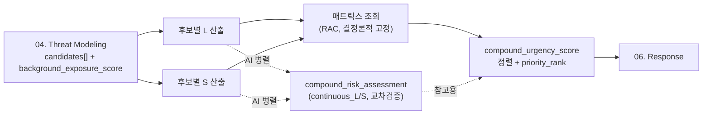

# 05. Risk Assessment

`04. Threat Modeling`이 넘겨주는 `candidates[]`(매칭된 위협 후보 전부)를 받아, 각 후보마다 "얼마나 위험한가"를 L(발생가능성)×S(심각도)→매트릭스 조회로 등급화(RAC)하고, 여러 후보가 동시에 떴을 때 어느 것부터 대응해야 하는지 우선순위를 매기는 계층입니다. RAC 산출은 항상 결정론적 매트릭스 조회이고, CPU 기반 AI 강화판이 병렬로 연속값(continuous_L/continuous_S)과 우선순위 점수를 추가로 계산하되 RAC 자체를 바꾸지는 않습니다.



---

## candidates 전체를 개별 평가

`04`가 이미 "여러 위협이 동시에 뜰 수 있다"는 전제로 `candidates[]`를 설계했으므로, `05`는 `primary` 하나만 보지 않고 candidates 전체를 각각 독립적으로 L×S→RAC 계산합니다. 위협이 하나도 매칭되지 않았을 때는 `ambient_rac`는 항상 `Low`입니다(Lead 결정, issue #24). `background_exposure_score`(T6, 배경 노출도)는 exposure 기반 Medium 승격 없이 참고 지표로 출력에 유지되며, `06`의 통보 메시지 등에서 소비할 수 있습니다.

---

## mission_context — 임무 전체 성격

L(발생가능성)의 기준값(base_rate)은 `(threat_event, mission_context)` 조합으로 조회합니다. `mission_context`는 `04`의 `declared_phase`(비행 국면: TAKEOFF/WAYPOINT/LOITER_ROI/RTL/LAND, 매 사이클 바뀜)와는 다른 개념으로, 임무 시작 전 `mission_brief`에 사람이 입력/승인하는 값입니다 — "지금 뭘 하고 있나"가 아니라 "이 임무 자체가 어떤 성격인가"를 나타냅니다.

`mission_context` 값 4종: `정찰`, `타격`, `호송`, `수송`.

---

## L(발생가능성) — 결정론적

### base_rate — threat_category에 따라 컨텍스트 민감도가 다름

위협을 `threat_category` 3종으로 나눕니다(이 분류는 `06`과 공유):

| threat_category | 위협 | 근거 |
|---|---|---|
| PHYSICAL | T3, T4 | 적이 물리적으로 근접 — 임무 성격(은밀정찰 vs 이미 노출된 타격)에 따라 발생가능성이 크게 달라짐 |
| REMOTE | T1, T2, T5 | 적이 원격으로 간섭(전자전/사이버/레이저) — 임무 종류보다 적의 전자전 자산 보유 여부에 더 좌우되므로 컨텍스트 무관 |
| NAVIGATION | T7 | 적대행위가 아닌 항법오류 — 임무 성격과 무관 |

PHYSICAL(T3/T4)만 4개 컨텍스트별로 다른 값을 갖고, REMOTE/NAVIGATION은 컨텍스트 무관 단일값입니다.

| threat_event | 정찰 | 타격 | 호송 | 수송 |
|---|---|---|---|---|
| T3 | 0.15 | 0.35 | 0.20 | 0.10 |
| T4 | 0.08 | 0.20 | 0.12 | 0.05 |

| threat_event | 값(컨텍스트 무관) |
|---|---|
| T1 | 0.12 |
| T2 | 0.10 |
| T5 | 0.08 |
| T7 | 0.10 |

전부 실측 이전 팀 추정치입니다. T3/T4는 "은밀기동(정찰) < 호송/수송 < 이미 교전상태(타격)" 순으로 노출도가 높아진다는 논리로 상대값을 매겼습니다.

### 등급화 + posture 보정

```
l_class_base = l_value_to_class(base_rate)   # A(≥0.5)~F(0) 6단계, MIL-STD-882E TableII 형식
steps = posture_shift_steps(posture, threat_event)   # 워치콘/데프콘(물리·EW계) 또는 인포콘(사이버) 기준
l_class_final = shift_class(l_class_base, steps)     # steps만큼 A쪽으로 이동(경계태세 높을수록 상향)
```

`posture_shift_steps`는 T1/T3/T4/T5/T7(물리·전자전계)은 `min(watchcon, defcon)`을, T2(사이버)는 `infocon`을 기준으로 합니다 — 이 분류는 `threat_category`(PHYSICAL/REMOTE/NAVIGATION)와는 다른 축(경계태세 체계가 원래 이렇게 나뉘어 있음)입니다.

---

## S(심각도) — 결정론적 + override

```
severity_label = OUTCOME_TO_SEVERITY[potential_outcome]     # 04에서 이미 정의된 매핑
severity_num = SEVERITY_ORDER[severity_label]                 # Catastrophic=1 ... Negligible=4

# 예비기체 없음(spare_asset_available=False) 또는 강제격상 조건(자폭드론 조우 등)이면 한 단계 격상
if not spare_asset_available or forced_override:
    severity_num_final = max(1, severity_num - 1)
else:
    severity_num_final = severity_num
```

예비기체가 없다는 건 "이 기체를 잃으면 72시간 공백"이라는 임무영향까지 심각도에 포함시켜야 한다는 뜻입니다(JRAM의 consequence 정의를 팀이 응용). 이미 Catastrophic(1)이면 더 못 올라가므로 override는 자연히 무효화됩니다.

---

## RAC — 매트릭스 조회, 항상 결정론적

```
RAC = RAC_MATRIX[(l_class_final, severity_num_final)]
```

| L\S | Catastrophic(1) | Critical(2) | Marginal(3) | Negligible(4) |
|---|---|---|---|---|
| A | High | High | Serious | Medium |
| B | High | Serious | Medium | Low |
| C | Serious | Serious | Medium | Low |
| D | Serious | Medium | Low | Low |
| E | Medium | Medium | Low | Low |
| F | Medium | Low | Low | Low |

**이 값은 AI가 절대 바꾸지 않습니다.** MIL-STD-882E의 Software Control Category(SCC-1, Autonomous)가 요구하는 "추적 가능한 결정 로직" 원칙과, 매트릭스 조회 자체가 "심각도는 순서형 등급이라 곱셈이 수학적으로 무효하다"는 설계 전제 때문에 AI를 의도적으로 배제합니다.

---

## AI 강화판 — 병렬 참고지표 (RAC에 영향 없음)

### 연속 L — 04의 confidence를 재사용

```
continuous_L = min(base_rate × (confidence / 0.7), min(base_rate × 3, 0.95))
```

`04`의 `confidence`(채널 quality의 로그오즈 결합값, 최저 앵커 0.7)로 base_rate를 보정합니다. 별도 AI 모델을 새로 만들지 않고 04가 이미 계산해둔 "센서가 이 위협을 얼마나 확실하게 보고 있는가"를 그대로 이어받습니다.

### 연속 S — margin_penalty

```
base_score = {Catastrophic:0.90, Critical:0.60, Marginal:0.30, Negligible:0.10}[severity_label_final]
margin_penalty = (+0.10 if battery_pct < 30%) + (+0.05 if spare_asset_available=False) + (+0.05 if link_quality < 0.5)
continuous_S = min(base_score + margin_penalty, 0.95)
```

지금 확실히 존재하는 필드(`mission_brief.battery_pct`, `spare_asset_available`, 04의 `link_status`/`link_integrity` 채널 quality)만 사용합니다. "운영마진(기상)" 같은 03에 없는 채널은 이번 라운드 범위 밖으로 명시합니다.

### 교차검증 — RAC_ai_equivalent

```
l_class_ai_final = shift_class(l_value_to_class(continuous_L), steps)   # 결정론과 같은 posture steps 적용
severity_num_ai = continuous_s_to_num(continuous_S)   # ≥0.75→1, ≥0.45→2, ≥0.20→3, else 4
RAC_ai_equivalent = RAC_MATRIX[(l_class_ai_final, severity_num_ai)]

ai_reliability = "low" if |RAC_ORDER[RAC] - RAC_ORDER[RAC_ai_equivalent]| >= 2 else "normal"
```

RAC_ai_equivalent가 실제 RAC와 2단계 이상 벌어지면 `ai_reliability="low"` 플래그만 달아 지상국에 경고합니다 — RAC 자체는 안 바뀝니다.

### compound_urgency_score — 우선순위 점수

```
compound_urgency_score = min(continuous_L × continuous_S + (0.1 if kill_chain_stage=="후기" else 0), 0.95)
```

L×S는 전통적 위험도 공식(Risk = Likelihood × Severity)의 표준 형태이고, kill_chain_stage 보너스는 "임박한 위협을 먼저 처리한다"는 PKC 취지를 순위에 반영합니다.

---

## candidates 정렬

```
priority_rank: compound_urgency_score 내림차순
             → 동률이면 severity_num_final 오름차순(더 심각한 쪽 우선)
             → 그래도 동률이면 match_count 내림차순
```

정렬된 배열 그대로 `06`에 전달합니다 — 1순위가 `06`이 실제로 반응할 대상이고, 나머지는 `secondary_threats`로 참고정보가 됩니다.

---

## 최종 출력 스키마

| 필드 | 의미 |
|---|---|
| candidates[] | priority_rank로 정렬된 위험평가 결과 배열. `04`의 candidate 필드(threat_event/match_count/confidence/confidence_source/kill_chain_stage/potential_outcome)를 전부 상속하고 아래 필드를 덧붙인 형태(`RiskCandidate(ThreatCandidate)` 계약) |
| candidates[].threat_event / match_count / confidence / confidence_source / kill_chain_stage / potential_outcome | `04`에서 그대로 상속(재계산 없음) |
| candidates[].rac | 결정론적 RAC(High/Serious/Medium/Low) |
| candidates[].l_class_final / severity_label_final | RAC 산출에 쓰인 등급 |
| candidates[].compound_risk_assessment | AI 병렬 참고지표(continuous_L/S, rac_ai_equivalent, ai_reliability) |
| candidates[].compound_urgency_score | 우선순위 정렬 기준 점수 |
| candidates[].priority_rank | 1부터, compound_urgency_score 내림차순 |
| ambient_rac | candidates가 비었을 때만 값이 있음, 항상 `Low`(Lead 결정, issue #24) |

```json
{
  "candidates": [
    {
      "threat_event": "T3", "match_count": 2, "confidence": 0.917,
      "confidence_source": "ai", "potential_outcome": "attrition_kill",
      "rac": "Serious",
      "l_class_final": "C", "severity_label_final": "Catastrophic",
      "kill_chain_stage": "후기",
      "compound_risk_assessment": {
        "continuous_L": 0.1965, "continuous_S": 0.95,
        "rac_ai_equivalent": "Serious", "ai_reliability": "normal"
      },
      "compound_urgency_score": 0.2867, "priority_rank": 1
    }
  ],
  "ambient_rac": null
}
```

---

## 파라미터 출처 정리

| 파라미터 | 값 | 출처/근거 |
|---|---|---|
| mission_context 4종 | 정찰/타격/호송/수송 | 팀 설정값 |
| BASE_RATE(PHYSICAL 8칸) | 0.05~0.35 | 팀 추정치(실측 전), 임무노출도 순서 논리로 상대값 부여 |
| BASE_RATE(REMOTE/NAVIGATION 4칸) | 0.08~0.12 | 팀 추정치(실측 전), 컨텍스트 무관 |
| l_value_to_class 임계값 | 0.5(A)/0.3(B)/0.15(C)/0.05(D)/0.01(E), 그 아래는 F | MIL-STD-882E Table II 형식 차용. `L_VALUE_TO_CLASS_THRESHOLDS`(constants.py)가 SSOT — E 임계값(0.01)이 최하 등급이고 그 미만은 F |
| posture_shift_steps 규칙 | watchcon/defcon(물리·EW) vs infocon(사이버) | 팀 자체 정의(공개 근거문헌 없음, `d4d_pipeline/threat_catalog.py` v1부터 유지) |
| 예비기체 override | 1단계 격상 | JRAM(CJCSM 3105.01B) consequence 정의를 팀이 응용 |
| RAC_MATRIX | 6×4 전체 | MIL-STD-882E Table III |
| CONFIDENCE_ANCHOR | 0.7 | 04의 CONFIDENCE_BY_MATCH_COUNT 최저값(1채널) 재사용 |
| BASE_SCORE(연속S 기준점) | 0.90/0.60/0.30/0.10 | 팀 설정값, 카테고리 중심값으로 정의 |
| margin_penalty 항목 | 배터리<30%(+0.10), 예비기체없음(+0.05), 링크quality<0.5(+0.05) | 팀 설정값, 확실히 존재하는 필드만 사용 |
| continuous_S→카테고리 임계값 | 0.75/0.45/0.20 | BASE_SCORE 인접 카테고리 중간점 |
| ai_reliability 임계값 | RAC_ORDER 차이 2단계 | 팀 설정값(04의 CROSS_CHECK_TOLERANCE와 같은 취지) |
| compound_urgency_score 킬체인보너스 | +0.1 | 팀 설정값 |
| ambient_rac 배경노출 임계값(`AMBIENT_EXPOSURE_THRESHOLD`) | 0.7 | **deprecated/reserved** — exposure≥0.7→Medium 승격 규칙은 issue #24 Lead 결정으로 폐기(candidates 없으면 항상 Low). 상수는 constants.py에 보존만 됨 |

세부 코드·손계산 검증은 `D-1. Risk Assessment Spec` 참고.
