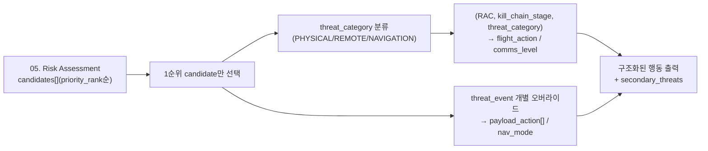

# 06. Response

`05. Risk Assessment`가 넘겨주는 정렬된 `candidates[]`를 받아, 1순위 위협에 대해 실제로 뭘 할지(비행/통신/무장/항법)를 구조화된 형태로 결정하는 계층입니다. 팀원(김수지·김호빈)이 정리한 RAC 플레이북·통신 사다리·위협별 대응방법 자료를 반영했습니다. 사람 개입 없이 실시간으로 도는 결정론적 상태기계이고, AI는 여기서 완전히 배제됩니다(05의 `ai_reliability` 같은 참고정보만 통보 메시지에 얹힘).



---

## 1순위만 실행, 나머지는 참고정보

05가 이미 `compound_urgency_score` 기준으로 candidates를 정렬해줬으므로, 06은 `priority_rank=1`인 후보 하나만 보고 행동을 결정합니다. 회피기동처럼 물리적 행동은 동시에 여러 개를 실행할 수 없는 경우가 많고, PKC(확률적 킬체인) 이론 자체가 "가장 임박한 단일 공격 경로"에 대응하는 걸 전제로 합니다. 나머지 후보는 `secondary_threats`(threat_event/rac/compound_urgency_score/priority_rank만 포함한 요약)로 부가정보만 남겨 지상국이 참고하게 합니다.

---

## threat_category — 3분류

`05`와 공유하는 분류체계입니다. RAC(급박도)와 별개로 "어떻게 대응할지"는 위협의 성격에 따라 완전히 다릅니다.

| threat_category | 위협 | 대응 논리 |
|---|---|---|
| PHYSICAL | T3(총격), T4(물리포획 — 지상 포획·그물 및 공중 적 드론 조우 포함) | 적이 이미 근접·육안인지 상태 — 즉시 이탈 + 통신 최소화 |
| REMOTE | T1(GPS스푸핑), T2(사이버하이재킹), T5(레이저) | 적이 원격/비접촉으로 간섭 — 물리적 회피보다 대체수단 전환이 핵심 |
| NAVIGATION | T7(지형충돌) | 적대행위가 아닌 항법오류 — 회피기동이 아니라 고도·경로 재계산이 정답 |

T4는 원래 "지상 병력의 그물·추격"만 염두에 뒀지만, 공중에서 접근하는 적 드론(자폭/충돌 시도)도 `class="drone"`으로 T4 판정조건에 흡수해서 카탈로그를 늘리지 않고 처리합니다(04의 선언적 룰 엔진이 이미 `class` 값 확장을 지원하도록 설계돼 있음).

---

## flight_action / comms_level — (RAC, kill_chain_stage, threat_category) 조회

`kill_chain_stage`는 RAC=High일 때만 관여합니다 — Serious 이하는 이미 "덜 급한" 등급이라 킬체인 진행단계를 또 따지는 게 과설계이고, PKC 이론도 "명중임박단계인데 대응 안 함"이 진짜 위험한 상황이라 High에서만 초긴급 여부를 가르는 게 이론적으로도 맞습니다.

### RAC = High

| threat_category | kill_chain_stage=후기/중기 (진행 임박) | kill_chain_stage=초기 |
|---|---|---|
| PHYSICAL | flight: `RTL`, comms: `L3` | flight: `POSTURE_ELEVATE`, comms: `L1` |
| REMOTE | flight: `REROUTE`, comms: `L2` | flight: `POSTURE_ELEVATE`, comms: `L1` |
| NAVIGATION | flight: `ALTITUDE_CHANGE_REROUTE`, comms: `L2` | flight: `POSTURE_ELEVATE`, comms: `L1` |

PHYSICAL은 적이 이미 육안으로 드론을 인지한 상태라 RF 노출 자체가 위치를 드러내는 추가위험이라 `L3`(최소통신)까지 낮춥니다. REMOTE는 적이 이미 전자기 스펙트럼으로 개입 중이라 통신을 더 줄여도 은닉효과가 크지 않아 `L2` 정도로 유지합니다. NAVIGATION도 완전한 풀영상보다는 대역폭을 아끼는 게 안전해 REMOTE와 같은 `L2`로 처리합니다.

**`POSTURE_ELEVATE`(kill_chain_stage=초기)의 구체적 의미(신규 확정)**: 아직 진행임박이 아니지만 RAC는 이미 High(임계 근접)이므로, 07(Flight Planning)이 예방적 고도상승 `+25m`(`ALTITUDE_CHANGE`의 +15m보다 큰 값 — High는 Serious보다 이미 더 심각한 등급이라는 걸 고도값에도 반영)을 지시하고, `special_action="INCREASE_ASSESSMENT_FREQUENCY"`로 05의 재평가 주기를 단축해 킬체인 진행(초기→중기/후기)을 더 빨리 잡아냅니다. 이전엔 두 값 다 미정(`None`)이었습니다.

### RAC = Serious / Medium / Low (threat_category 무관, kill_chain_stage 무관)

| RAC | flight_action | comms_level | special_action |
|---|---|---|---|
| Serious | `ALTITUDE_CHANGE` | `L1` | `GCS_CONSULT`(기지국 판단 요청) |
| Medium | `MAINTAIN` | `L1` | `INCREASE_ASSESSMENT_FREQUENCY`(05 재평가 주기 단축) |
| Low | `MAINTAIN` | `L0` | 없음 |

---

## payload_action — threat_event 개별 오버라이드 (리스트형)

**RAC=High이고 kill_chain_stage가 후기/중기일 때만**(실제로 회피기동이 트리거될 때만) 적용됩니다. 위협마다 여러 조치가 동시에 필요할 수 있어 `payload_action`은 문자열이 아니라 리스트입니다.

### DATA_WIPE — 크립토그래픽 소거 (T3, T4)

수집한 정찰 데이터(원본 영상·센서로그)는 평소 온보드에 암호화 상태로 저장되고, `DATA_WIPE`는 파일을 물리적으로 지우는 게 아니라 **암호화 키를 즉시 파기**하는 방식입니다(crypto-erase). 키는 휘발성 메모리(RAM)에만 상주하고, 가능하면 지상통제센터(GCS)와의 세션키 동기화도 함께 무효화합니다.

물리 삭제는 저장매체 용량에 따라 수 분이 걸릴 수 있어 T4(포획 임박, kill_chain_stage 후기/중기 — 몇 초 단위)의 시간 제약과 맞지 않습니다. 반면 키 파기는 즉시 끝나고, 키가 없으면 저장매체를 통째로 확보해도 데이터 복구가 불가능합니다.

**적용 대상은 PHYSICAL(T3/T4)만입니다** — 적에게 기체가 넘어갈 수 있는 상황(격추·포획)이 공통 조건입니다. T7(지형충돌)은 적대행위가 아니고 07의 고도상승 대응으로 대부분 즉시 해소되는 문제라 제외했고, REMOTE(T1/T2/T5)는 통제권 상실·센서 무력화 상황이지 기체가 물리적으로 넘어가는 상황이 아니라 제외했습니다.

### WEAPON_DROP — 무장기체 확장 대비 조건부 (T3만)

지금 기체(리모아이-006, EO카메라만 탑재)는 순수 정찰용이라 실제로 버릴 무장이 없습니다. `WEAPON_DROP`은 `mission_brief.drone_profile.armament`(`B-1. 지상통제센터 AI 세부`에 이미 정의된 필드, 06으로 직접 전달)에 `expendable=true`인 항목이 있을 때만 조건부로 실행되고, 지금은 사실상 no-op입니다 — 향후 무장형 기체가 추가되면 06/07 로직을 바꾸지 않고도 자동으로 유효해지는 구조입니다. 실제로 어떤 부품을 투기 가능하게 만들지는 기체 하드웨어 설계 사안이라 이 문서 범위 밖입니다.

무게감소로 이탈속도를 높인다는 취지라 총격(T3)에만 적용하고, 포획(T4)에는 적용하지 않습니다(포획은 속도로 벗어나는 상황이 아님).

| threat_event | payload_action | nav_mode |
|---|---|---|
| T3 | `[DATA_WIPE]`(+ 무장기체면 `WEAPON_DROP` 추가) | — |
| T4 | `[DATA_WIPE]` | — |
| T1 | `[]` | `INS_ONLY`(관성항법 전환) |
| T2, T5, T7 | `[]` | — |

T2(사이버하이재킹)는 명령 위조가 문제라 항법수단 전환과 무관하고, T5(레이저)는 센서 각도 전환이 더 적합한 대응이라 항법모드 오버라이드를 두지 않았습니다.

---

## 자폭 드론 조우 — T4 강제 심각도 격상

일반 T4(그물·추격)와 달리, 자폭 드론은 확률(L)이 낮게 나와도 접촉하면 결과가 항상 치명적입니다. 05의 `severity_category_override`에 `forced_severity_override=True` 플래그를 별도로 얹어(예비기체 유무와 무관하게) 심각도를 한 단계 강제 격상합니다 — 다만 **RAC는 여전히 매트릭스 조회 결과**이고, 매트릭스를 완전히 우회해서 RAC를 하드코딩하지는 않습니다(SCC-1 "단일 결정경로" 원칙 유지).

---

## 04와의 연동 — context 3출처 분리 (신규 확정, 배선은 보류)

06/07이 04로부터 받아야 할 위치·분류·기체스펙 정보를 하나의 `context` 블롭에 뭉치지 않고 출처별로 분리했습니다.

| 출처 | 스키마 | 특성 |
|---|---|---|
| `candidates[].context` (04, threat_event별) | `{"bearing_deg", "bearing_source", "class"}` | 사이클·위협마다 다름. T4 자폭드론 판별(`class="drone"`)도 여기서 옴 |
| `cycle_context` (04, 사이클 단위) | `{"optimal_terrain_bearing_deg", "lowest_exposure_bearing_deg"}` | 위협과 무관, 07의 지형기반 방향결정에 사용 |
| `mission_brief.drone_profile` (B-1, 미션 단위) | `{"armament": [...]}` | 04를 거치지 않고 06으로 직접 전달, WEAPON_DROP 조건부 실행용 |

이 분리 덕분에 `run_response(risk_result, candidate_contexts, drone_profile)`처럼 `drone_profile`이 candidate별 context가 아니라 독립된 인자로 들어갑니다. 실제 04 코드가 이 스키마로 값을 채워 넘기는 배선 자체는 04/05/06/07 코드 통합 라운드로 보류합니다(04는 이미 확정 반영된 상태라 지금 다시 건드리지 않음). 세부는 `E-1. Response Spec` 4절 참고.

---

## 최종 출력 스키마

| 필드 | 의미 |
|---|---|
| primary_threat_event | 1순위 위협(없으면 null) |
| rac / kill_chain_stage / threat_category | 1순위 위협의 05/04 산출값 |
| flight_action / comms_level | 전략적 행동(위 테이블 조회) |
| payload_action | 전술적 개별 오버라이드 리스트(threat_event별, 비어있을 수 있음) |
| nav_mode | 전술적 개별 오버라이드(threat_event별) |
| special_action | Serious/Medium 및 High+초기(POSTURE_ELEVATE) 전용 부가 지시 |
| secondary_threats[] | 2순위 이하 위협 요약(threat_event/rac/compound_urgency_score/priority_rank) |
| ai_reliability | 05에서 넘어온 값, 행동 자체엔 영향 없이 지상국 통보에만 참고 |

```json
{
  "primary_threat_event": "T3",
  "rac": "High",
  "kill_chain_stage": "후기",
  "threat_category": "PHYSICAL",
  "flight_action": "RTL",
  "comms_level": "L3",
  "payload_action": ["DATA_WIPE"],
  "nav_mode": null,
  "special_action": null,
  "secondary_threats": [],
  "ai_reliability": "normal"
}
```

candidates가 비어있으면(위협 미탐지) `primary_threat_event=null`, `rac`는 05의 `ambient_rac`을 그대로 써서 동일한 테이블로 행동을 결정합니다.

---

## 파라미터 출처 정리

| 파라미터 | 값 | 출처/근거 |
|---|---|---|
| threat_category 3분류 | PHYSICAL/REMOTE/NAVIGATION | 팀원 자료(RAC 플레이북) + 05와 공유 |
| flight_action/comms_level 테이블 | 위 표 | 팀원 자료(RAC 플레이북) 그대로 채택, T7(NAVIGATION) 항목만 T7 섹션 내용으로 신규 보강 |
| DATA_WIPE 대상 | T3, T4(PHYSICAL만) | 팀 설계값, 크립토그래픽 소거는 보안공학 표준 패턴(crypto-shredding) |
| DATA_WIPE 메커니즘 | 암호화 키 RAM 파기 + GCS 세션키 동기화 | 팀 설계값, T4의 시간제약(몇 초) 근거 |
| WEAPON_DROP 조건부 실행 | drone_profile.armament.expendable 조회 | 팀 설계값, B-1의 기존 armament 필드 재사용 |
| 자폭드론 T4 흡수 | class="drone" | 팀원 자료의 "적 드론 조우" 시나리오 반영, 04 룰엔진의 class 확장성 활용 |
| kill_chain_stage 적용범위 | RAC=High에서만 | 팀 설계값(기존 v1 `response_action` 로직 유지) |
| special_action 값 | GCS_CONSULT / INCREASE_ASSESSMENT_FREQUENCY | 팀원 자료(기지국 판단요청) + 팀 설계값(05 재평가 주기, POSTURE_ELEVATE에도 재사용) |
| POSTURE_ELEVATE 고도값 | +25m | 팀 설계값, Serious(+15m)보다 심각한 등급이라는 점을 반영해 상향 |
| context 3출처 분리 | candidates[].context / cycle_context / mission_brief.drone_profile | 팀 설계값, 04 코드 배선은 보류 |

세부 코드·손계산 검증(T3 단독/T4 posture 격상/T3+T4 동시발생/무장·데이터삭제 조건분기/POSTURE_ELEVATE)은 `E-1. Response Spec` 참고. 위협별 실제 탐지 구현 참고자료(XGBoost GPS스푸핑탐지, MAVLink 무결성검사, 총성탐지 데이터셋, DEM 지형데이터 등)는 별도 정리 예정입니다.
