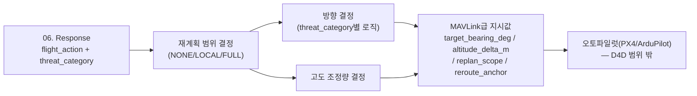

# 07. Flight Planning

`06. Response`가 정한 `flight_action`(RTL/REROUTE/ALTITUDE_CHANGE_REROUTE/ALTITUDE_CHANGE/MAINTAIN/POSTURE_ELEVATE — "무엇을 할지")을 받아, 실제로 "어느 방향으로, 얼마나, 국소기동인지 전체재계획인지"를 계산하는 계층입니다. 웨이포인트 좌표나 실시간 궤적까지는 계산하지 않고, 오토파일럿(PX4/ArduPilot, MAVLink 기반)이 받아서 실행할 수 있는 상위 지시값까지만 산출합니다.



---

## 레이어를 분리한 이유

실제 경로점 계산(DEM 기반 장애물 회피, MPC 궤적 최적화)은 위협 판단 로직과 완전히 다른 종류의 엔지니어링 문제(항법/제어공학)이고, 요구되는 실시간성도 다릅니다(수십 Hz급 궤적최적화 vs 04~06의 사이클 단위 판단). 04(하드웨어 SWaP 제약 확인 시점)에서 이미 GPU가 인식모델로 상시 점유돼 있다는 걸 확인했으므로, 실시간 궤적최적화까지 같은 온보드 컴퓨트에 얹는 건 비현실적입니다. 07은 "어느 방향으로 왜"까지만 결정하고, 세부 궤적 최적화는 오토파일럿/비행제어 소프트웨어의 몫으로 남깁니다.

---

## 재계획 범위 — flight_action별 매핑

| flight_action | replan_scope | 의미 |
|---|---|---|
| RTL | LOCAL | 위협 반대방향으로 즉시 이탈 후, 이후는 사전 저장된 안전 귀환로를 그대로 따름(재계획 없음) |
| REROUTE | FULL | 목적지는 유지, 남은 경로점을 위협 회피하도록 재계산 |
| ALTITUDE_CHANGE_REROUTE | FULL | 고도상승 + 남은 경로점 재계산 |
| ALTITUDE_CHANGE | LOCAL | 현재 경로 유지, 고도값만 예방적으로 조정 |
| POSTURE_ELEVATE | LOCAL | 현재 경로 유지, 고도값만 더 크게 예방적으로 조정(신규 확정 — 아래 참고) |
| MAINTAIN | NONE | 경로 변경 없음 |

`RTL`은 이미 정해진 목적지(기지)가 있어 재계획이 아니라 "위협을 피해 그 목적지로 가는 첫 스텝"만 계산하면 되고, `REROUTE`류는 남은 임무를 계속 수행해야 하니 경로점 자체를 다시 짭니다. `ALTITUDE_CHANGE`(Serious 등급)는 아직 위협이 확정적으로 근접하지 않은 예방적 조치라 고도만 소폭 조정합니다.

**`POSTURE_ELEVATE`(신규 확정)**: RAC=High인데 아직 kill_chain_stage=초기(진행임박 전)일 때의 예방적 고도상승입니다. 이전엔 `replan_scope="NONE"`(아무것도 안 함)으로 미정 처리돼 있었으나, "이미 High 등급인데 진짜로 아무 조치도 안 하는 건 이상하다"는 재검토를 거쳐 `ALTITUDE_CHANGE`와 같은 패턴(고도만 조정, `replan_scope="LOCAL"`)으로 확정했습니다. 다만 상승폭은 Serious(+15m)보다 큰 **+25m**로 잡아, RAC=High가 Serious보다 이미 더 심각한 등급이라는 걸 반영합니다.

---

## 방향 결정 — threat_category별로 다른 기준

### PHYSICAL(T3/T4) — 위협 방위각의 정반대

04의 `candidates[].context`에 threat_event별로 `bearing_deg`(위협 방위각)가 실려 옵니다. 이 값은 03의 `proximity_object`/`acoustic_event`/`rf_spectrum` 채널 중 우선순위(카메라가 제일 정밀) `proximity_object > acoustic_event > rf_spectrum` 순으로 04가 이미 골라서 넘긴 단일 값입니다(07은 채널을 직접 탐색하지 않음 — 아래 "04와의 연동" 참고). 07은 그 정반대 방향(`(bearing_deg + 180) mod 360`)으로 이탈합니다. bearing_deg가 없으면(방향 추정 불가) `cycle_context`의 지형기반 대체(가장 낮은 노출도 인접방향, `lowest_exposure_bearing_deg`)로 폴백합니다.

### REMOTE(T1/T2/T5) — bearing 있으면 반대방향, 없으면 마지막 정상위치로

사이버하이재킹(T2)은 애초에 위치 개념이 없고, GPS스푸핑(T1)도 재머 방향을 항상 알 수 있는 건 아닙니다. bearing_deg를 구할 수 있으면(T1이 rf_spectrum 방향탐지에 성공한 경우) PHYSICAL과 같은 로직을 쓰고, 못 구하면 "간섭이 시작되기 전 마지막 정상 상태의 경로점으로 복귀"를 기준으로 삼습니다 — "어디서 오는가"보다 "어디서부터 문제가 생겼는가"가 사이버/GPS계 위협에는 더 신뢰할 수 있는 정보이고, 이 값은 이미 비행 로그에 기록돼 있어 새로운 추정이 필요 없습니다.

### NAVIGATION(T7) — 고도상승이 1차 방어선, 방향은 최적지형

지형충돌은 적이 아니라 지형 장애물이라 방위각 개념보다 고도가 먼저입니다. 고도를 충분히 높이면 대부분 즉시 해소되므로 항상 1차 대응으로 고도상승을 두고, 수평 방향은 `terrain_class.dominant_class="open_field"`이면서 `exposure_score`가 가장 낮은 인접 방향(`cycle_context.optimal_terrain_bearing_deg`)을 목표로 삼습니다.

---

## 고도 조정량

| flight_action | altitude_delta_m |
|---|---|
| ALTITUDE_CHANGE(Serious, 예방적) | +15 |
| POSTURE_ELEVATE(High+초기, 예방적) | +25(신규 확정) |
| ALTITUDE_CHANGE_REROUTE(T7 High, 지형회피 우선) | +50 |
| 그 외 | 0 |

---

## 최종 출력 스키마 — MAVLink급 지시값까지만

| 필드 | 의미 |
|---|---|
| target_bearing_deg | 목표 방위각(0~360), 방향 결정 불가 시 null |
| altitude_delta_m | 고도 조정량(m) |
| replan_scope | NONE / LOCAL / FULL |
| reroute_anchor | 방향/재계획 기준(`threat_reverse(channel)` / `terrain_fallback` / `last_known_good_position` / `optimal_terrain` / `altitude_only`) |

```json
{
  "flight_action": "RTL",
  "target_bearing_deg": 225,
  "altitude_delta_m": 0,
  "replan_scope": "LOCAL",
  "reroute_anchor": "threat_reverse(proximity_object)"
}
```

이 지시값을 받은 뒤 실제 웨이포인트 시퀀스·궤적 최적화(Risk-A*/MPC 등)를 계산하는 건 오토파일럿/비행제어 소프트웨어의 몫이며 D4D AI 시스템의 책임범위 밖입니다.

---

## 04와의 연동 — context/cycle_context 분리 (신규 확정, 배선은 보류)

이전엔 04의 candidate 출력에 `bearing_deg`류 위치정보와 지형정보(`optimal_terrain_bearing_deg` 등)를 하나의 `context` 필드에 뭉쳐 넣을 계획이었지만, 이번 라운드에서 07이 실제로 받는 정보의 성격이 서로 다르다는 걸 재확인하고 출처를 분리했습니다.

| 출처 | 스키마 | 07에서의 역할 |
|---|---|---|
| `candidates[].context` (04, threat_event별) | `{"bearing_deg", "bearing_source", "class"}` | PHYSICAL/REMOTE 방향 계산의 1순위 입력. 04가 채널 우선순위 탐색을 이미 끝낸 값 |
| `cycle_context` (04, 사이클 단위) | `{"optimal_terrain_bearing_deg", "lowest_exposure_bearing_deg"}` | NAVIGATION 방향 계산 + PHYSICAL/REMOTE의 지형 폴백 |

`run_flight_planning(response_result, context, cycle_context)`처럼 두 정보를 별도 인자로 받습니다. 구버전은 07이 채널별 flat key(`proximity_object_bearing_deg` 등)를 직접 탐색했지만, 그 우선순위 탐색 로직 자체를 04로 이전해 07은 이미 결정된 단일 값만 소비하도록 단순화했습니다. 실제 04 코드에서 이 스키마로 값을 채워 넘기는 배선은 04/05/06/07 코드 통합 라운드로 보류합니다(04는 이미 Obsidian에 확정 반영된 상태라 지금 다시 건드리지 않음).

---

## 파라미터 출처 정리

| 파라미터 | 값 | 출처/근거 |
|---|---|---|
| REPLAN_SCOPE_BY_FLIGHT_ACTION | 위 표 | 팀 설계값(RTL=고정목적지라 LOCAL, REROUTE류=목적지 유지라 FULL, POSTURE_ELEVATE는 ALTITUDE_CHANGE와 같은 패턴으로 LOCAL) |
| bearing 우선순위 | proximity_object > acoustic_event > rf_spectrum | 팀 설계값, 카메라가 가장 정밀하다는 논리(탐색 로직은 04로 이전) |
| ALTITUDE_DELTA_PREVENTIVE_M | 15m | 팀 설정값(실측 전) |
| POSTURE_ELEVATE_ALTITUDE_M | 25m | 팀 설정값(신규 확정, 실측 전), "High는 Serious보다 이미 심각"이라는 논리로 15m보다 상향 |
| ALTITUDE_DELTA_TERRAIN_M | 50m | 팀 설정값(실측 전), "고도로 대부분의 지형위험 해소" 논리 |
| REMOTE bearing 없을 때 anchor | last_known_good_position | 팀 설계값, 비행로그 재사용 |
| NAVIGATION 방향 기준 | optimal_terrain(exposure_score 최소) | terrain_class 채널(`03. Sensor Abstraction Layer`) 재사용, cycle_context로 전달 |
| context/cycle_context 분리 | candidates[].context / cycle_context | 팀 설계값, 04 코드 배선은 보류 |
| 07 출력 범위 경계 | MAVLink급 지시값까지, 웨이포인트 미계산 | 팀 설계값, SWaP 제약(04에서 확인된 GPU 상시점유) 근거 |

세부 코드·손계산 검증은 `F-1. Flight Planning Spec` 참고.
