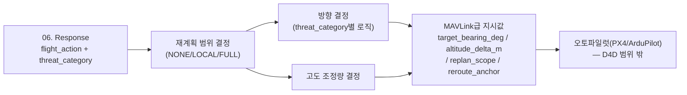

# 07. Flight Planning

`06. Response`가 정한 `flight_action`(RTL/REROUTE/ALTITUDE_CHANGE_REROUTE/ALTITUDE_CHANGE/MAINTAIN/POSTURE_ELEVATE — "무엇을 할지")을 받아, 실제로 "어느 방향으로, 얼마나, 국소기동인지 전체재계획인지"를 계산하는 계층입니다. 웨이포인트 좌표나 실시간 궤적까지는 계산하지 않고, 오토파일럿(PX4/ArduPilot, MAVLink 기반)이 받아서 실행할 수 있는 상위 지시값까지만 산출합니다.



---

## 레이어를 분리한 이유

실제 경로점 계산(DEM 기반 장애물 회피, MPC 궤적 최적화)은 위협 판단 로직과 완전히 다른 종류의 엔지니어링 문제(항법/제어공학)이고, 요구되는 실시간성도 다릅니다(수십 Hz급 궤적최적화 vs 04~06의 사이클 단위 판단). 04(하드웨어 SWaP 제약 확인 시점)에서 이미 GPU가 인식모델로 상시 점유돼 있다는 걸 확인했으므로, 실시간 궤적최적화까지 같은 온보드 컴퓨트에 얹는 건 비현실적입니다. 07은 "어느 방향으로 왜"까지만 결정하고, 세부 궤적 최적화는 오토파일럿/비행제어 소프트웨어의 몫으로 남깁니다.

---

## 재계획 범위 — flight_action별 매핑

| flight_action | replan_scope | 의미 |
|---|---|---|
| RTL | LOCAL | 위협 반대방향으로 즉시 이탈 후, 이후는 사전 저장된 안전 귀환로를 그대로 따름(재계획 없음) |
| REROUTE | FULL | 목적지는 유지, 남은 경로점을 위협 회피하도록 재계산 |
| ALTITUDE_CHANGE_REROUTE | FULL | 고도상승 + 남은 경로점 재계산 |
| ALTITUDE_CHANGE | LOCAL | 현재 경로 유지, 고도값만 예방적으로 조정 |
| POSTURE_ELEVATE | LOCAL | 현재 경로 유지, 고도값만 더 크게 예방적으로 조정(신규 확정 — 아래 참고) |
| MAINTAIN | NONE | 경로 변경 없음 — `reroute_anchor`는 `null`이 아니라 `mission_corridor_resume`(신규 확정, 아래 참고 — 직전 라운드의 "null 계약" 결정을 의도적으로 뒤집음) |

`RTL`은 이미 정해진 목적지(기지)가 있어 재계획이 아니라 "위협을 피해 그 목적지로 가는 첫 스텝"만 계산하면 되고, `REROUTE`류는 남은 임무를 계속 수행해야 하니 경로점 자체를 다시 짭니다. `ALTITUDE_CHANGE`(Serious 등급)는 아직 위협이 확정적으로 근접하지 않은 예방적 조치라 고도만 소폭 조정합니다.

**`MAINTAIN`의 `reroute_anchor`(신규 확정, 이전 결정 번복) — "회피 후 복귀"가 실제로 뭘 뜻하는가**: 직전 라운드에서 "`replan_scope=NONE`이면 `reroute_anchor=null`"을 계약으로 명시했었으나, 이번 라운드에서 재검토해 뒤집었습니다. 이유: `NONE`은 "D4D가 새 지시를 안 낸다"는 뜻이지 "오토파일럿이 뭘 해야 하는지 모른다"는 뜻이면 안 됩니다. 회피(REROUTE/RTL 등) 중이던 위협이 해소돼 다시 `MAINTAIN`으로 돌아오면, `reroute_anchor="mission_corridor_resume"`을 실어 보냅니다 — 이건 D4D가 좌표를 계산해서 "여기로 가라"고 지시하는 게 아니라, **오토파일럿 자체의 미션시퀀서(PX4/ArduPilot AUTO.MISSION 모드가 이미 관리하는 현재 활성 웨이포인트 인덱스)에게 통제권을 돌려주는 릴리스 신호**입니다. 회피 직전 위치로 되돌아가거나(낭비, 그 지점이 여전히 위협권일 수 있음) 목적지로 직행하는 것(중간 웨이포인트의 임무가치 — 정찰 지점 등 — 를 포기)이 아니라, **남은 웨이포인트 중 가장 가까운 곳부터 자연스럽게 이어가는 것**이 의도이고, 이건 D4D가 직접 계산하는 게 아니라 오토파일럿의 기존 미션 프로토콜이 원래 하는 동작입니다. `MAINTAIN`일 때 항상(위협이 있었든 없었든) 이 값을 실어 보냅니다 — 07 파이프라인은 무상태(ADR-004)라 "직전에 회피 중이었는지"를 따로 기억하지 않고, MAVLink 미션모드 복귀 신호 자체가 멱등(이미 미션모드여도 재전송 무해)이라 매 사이클 동일하게 보내도 문제가 없기 때문입니다.

**`POSTURE_ELEVATE`(신규 확정)**: RAC=High인데 아직 kill_chain_stage=초기(진행임박 전)일 때의 예방적 고도상승입니다. 이전엔 `replan_scope="NONE"`(아무것도 안 함)으로 미정 처리돼 있었으나, "이미 High 등급인데 진짜로 아무 조치도 안 하는 건 이상하다"는 재검토를 거쳐 `ALTITUDE_CHANGE`와 같은 패턴(고도만 조정, `replan_scope="LOCAL"`)으로 확정했습니다. 다만 상승폭은 Serious(+15m)보다 큰 **+25m**로 잡아, RAC=High가 Serious보다 이미 더 심각한 등급이라는 걸 반영합니다.

---

## 방향 결정 — threat_category별로 다른 기준

### PHYSICAL(T3/T4) — 위협 방위각의 정반대

04의 `candidates[].context`에 threat_event별로 `bearing_deg`(위협 방위각)가 실려 옵니다. 이 값은 03의 `proximity_object`/`acoustic_event`/`rf_spectrum` 채널 중 우선순위(카메라가 제일 정밀) `proximity_object > acoustic_event > rf_spectrum` 순으로 04가 이미 골라서 넘긴 단일 값입니다(07은 채널을 직접 탐색하지 않음 — 아래 "04와의 연동" 참고). 07은 그 정반대 방향(`(bearing_deg + 180) mod 360`)으로 이탈합니다. bearing_deg가 없으면(방향 추정 불가) `cycle_context`의 지형기반 대체(가장 낮은 노출도 인접방향, `lowest_exposure_bearing_deg`)로 폴백합니다.

### REMOTE(T1/T2/T5) — bearing 있으면 반대방향, 없으면 마지막 정상위치로

사이버하이재킹(T2)은 애초에 위치 개념이 없고, GPS스푸핑(T1)도 재머 방향을 항상 알 수 있는 건 아닙니다. bearing_deg를 구할 수 있으면(T1이 rf_spectrum 방향탐지에 성공한 경우) PHYSICAL과 같은 로직을 쓰고, 못 구하면 "간섭이 시작되기 전 마지막 정상 상태의 경로점으로 복귀"를 기준으로 삼습니다 — "어디서 오는가"보다 "어디서부터 문제가 생겼는가"가 사이버/GPS계 위협에는 더 신뢰할 수 있는 정보이고, 이 값은 이미 비행 로그에 기록돼 있어 새로운 추정이 필요 없습니다.

### NAVIGATION(T7) — 고도상승이 1차 방어선, 방향은 최적지형

지형충돌은 적이 아니라 지형 장애물이라 방위각 개념보다 고도가 먼저입니다. 고도를 충분히 높이면 대부분 즉시 해소되므로 항상 1차 대응으로 고도상승을 두고, 수평 방향은 `terrain_class.dominant_class="open_field"`이면서 `exposure_score`가 가장 낮은 인접 방향(`cycle_context.optimal_terrain_bearing_deg`)을 목표로 삼습니다.

---

## 고도 조정량

| flight_action | altitude_delta_m |
|---|---|
| ALTITUDE_CHANGE(Serious, 예방적) | +15 |
| POSTURE_ELEVATE(High+초기, 예방적) | +25(신규 확정) |
| ALTITUDE_CHANGE_REROUTE(T7 High, 지형회피 우선) | +50 |
| 그 외 | 0 |

---

## 속도 조정 — speed_mode (신규)

방향·고도와 마찬가지로 속도도 "얼마나 급하게 움직여야 하는가"를 오토파일럿에 알려줘야 합니다. 다만 실제 목표 m/s 계산(가속도 프로파일, 배터리 소모 트레이드오프)은 항법/제어공학 영역이라 07 범위 밖입니다 — `altitude_delta_m`이 정확한 상승률이 아니라 "상수 3종 중 하나"인 것과 같은 이유로, 속도도 `flight_action`에서 그대로 뽑는 **이산 카테고리** 하나만 지시합니다.

| flight_action | speed_mode | 근거 |
|---|---|---|
| RTL | MAX | 즉시 이탈이 목적 |
| REROUTE | MAX | 회피 진행중 — 위협 노출시간 최소화 |
| ALTITUDE_CHANGE_REROUTE | MAX | 지형충돌 회피 진행중 |
| POSTURE_ELEVATE | CAUTIOUS | 아직 kill_chain_stage=초기(진행임박 아님), 상승 중 안정성 우선 |
| ALTITUDE_CHANGE | NORMAL | 예방적 조치, 급박하지 않음 |
| MAINTAIN | NORMAL | 평시 |

`flight_action` 하나로 값이 정해지는 순수 룩업이라 추가 판단·이력 로직이 필요 없습니다. CFIT override(TTC<3s → `ALTITUDE_CHANGE` 강제)가 적용된 뒤의 `effective_action` 기준으로 계산되므로, override가 걸리면 `speed_mode`도 override 이후 값(NORMAL)을 따릅니다.

### `mission_brief.weights`(운용자 임무 가치 가중치) 연결 (신규)

`weights`(스텔스/생존성/정보가치/신속성, 01 GCS에서 운용자가 설정)는 그동안 스키마·예제·테스트에만 존재하고 실제 결정 로직 어디에서도 읽히지 않는 죽은 값이었습니다(grill-me로 발견). `target_bearing_deg`/`altitude_delta_m`/`route`/`reroute_anchor`는 이미 RAC 기반 결정론(안전 우선)이라 선호도가 끼어들 자리가 없지만, `speed_mode`는 순수 이산 룩업이라 weights가 들어갈 자연스러운 자리입니다.

**적용 범위는 `MAINTAIN`/`ALTITUDE_CHANGE`/`POSTURE_ELEVATE` 뿐**입니다 — `RTL`/`REROUTE`/`ALTITUDE_CHANGE_REROUTE`는 이미 회피가 진행 중(항상 `MAX`)이라 스텔스 선호로 속도를 늦추면 위험하므로 제외합니다(SCC-1). `weights.survival - weights.stealth` 우세가 `SPEED_WEIGHT_DOMINANCE_MARGIN`(=0.1)을 넘으면 `CAUTIOUS < NORMAL < MAX` 축에서 한 단계만 상/하향합니다(그 이상 안 감, clamp):

| flight_action | 기본 speed_mode | survival 우세 | stealth 우세 |
|---|---|---|---|
| MAINTAIN | NORMAL | MAX | CAUTIOUS |
| ALTITUDE_CHANGE | NORMAL | MAX | CAUTIOUS |
| POSTURE_ELEVATE | CAUTIOUS | NORMAL | CAUTIOUS(바닥, 더 못 내려감) |

**CFIT override로 강제된 `ALTITUDE_CHANGE`(지형충돌 임박)는 weights와 무관하게 항상 `NORMAL` 고정**입니다 — 안전 최우선(SCC-1)이 운용자 선호보다 우선하므로, `run.py`는 CFIT가 걸린 사이클에는 `weights`를 아예 넘기지 않습니다.

---

## RAC 완화 디바운스 — RTL↔MAINTAIN 진동 방지 (신규, ADR-004 예외)

06은 매 사이클 RAC를 결정론적으로 재계산하는 무상태 함수입니다(`flight_comms.resolve`). 링크 열화·센서 노이즈로 RAC가 사이클마다 `High → Medium → High → ...`처럼 흔들리면, 07이 매번 그대로 따라가 `RTL ↔ MAINTAIN`을 오갈 수 있습니다 — 실제 오토파일럿 입장에서는 미션모드 복귀 직후 다시 RTL을 받는 꼴이라 실기동 낭비·불안정의 원인이 됩니다.

**비대칭 디바운스**를 07에 추가해 해결합니다. 기준은 05가 이미 쓰는 `RAC_ORDER`(High=1 < Serious=2 < Medium=3 < Low=4, 숫자가 작을수록 심각)를 그대로 재사용합니다:

- **악화**(RAC_ORDER 숫자가 감소 = 더 심각해짐) → **즉시 반영**. 안전 우선(SCC-1) — 위협이 심해지는 걸 지연시키지 않습니다.
- **완화**(RAC_ORDER 숫자가 증가 = 덜 심각해짐) → **`FLIGHT_ACTION_DEESCALATE_DEBOUNCE_CYCLES`(=3)사이클 연속** 같은(또는 더 낮은) RAC가 유지될 때만 반영. 그 전까지는 직전에 확정(committed)된 `flight_action`을 그대로 유지합니다.
- **CFIT override는 디바운스보다 항상 우선**합니다 — TTC<3s 지형충돌 위험은 RAC/디바운스 상태와 무관하게 즉시 `ALTITUDE_CHANGE`를 강제합니다.

> ⚠️ **버그 수정(grill-me 3라운드)**: 처음엔 RAC_ORDER만 비교했는데, `06. Response`의 `flight_comms.resolve()`를 보면 **RAC=High 구간에서는 `flight_action`이 RAC뿐 아니라 `kill_chain_stage`(초기/중기/후기)와 `threat_category`에도 좌우**됩니다(예: High+초기=`POSTURE_ELEVATE`, High+후기+PHYSICAL=`RTL` — 둘 다 RAC_ORDER=1로 동일). RAC_ORDER만 비교하면 RAC=High가 유지된 채 kill_chain_stage가 초기→후기로 진행돼도(진짜 위협 임박) "변화 없음"으로 오판해 `POSTURE_ELEVATE`를 그대로 고정하는 버그가 있었습니다. 다음 두 조건을 **즉시 반영** 대상에 추가해 고쳤습니다:
> - **`primary_threat_event`가 바뀌면**(T3→T1 등) 완전히 다른 위협이므로 디바운스 상태를 리셋하고 그 사이클의 판단을 그대로 신뢰합니다.
> - **RAC_ORDER는 그대로인데 `kill_chain_stage`가 진행**(초기→중기/후기, 같은 threat_event)되면 악화로 간주해 즉시 반영합니다.
>
> `KILL_CHAIN_STAGE_ORDER`(초기=1<중기=2<후기=3)를 `constants.py`에 추가해 이 비교에 씁니다.

이건 파이프라인 전체(ADR-001)가 아니라 **07 한 계층에 한정된, 명시적이고 의도적인 ADR-004 예외**입니다: 무상태 원칙은 "레이어 간 통신은 JSON dict"라는 원래 취지이지 "사이클 간 기억을 절대 허용 안 함"은 아니었고, 03의 `previous_qualities`가 이미 같은 방식의 선례입니다. 07도 동일 패턴을 재사용합니다 — `debounce_state`를 입력으로 받고, 오케스트레이터(`src/onboard/run.py`)가 `extract_flight_plan_state()`로 다음 사이클용 상태를 뽑아 다음 호출에 넘겨줍니다. `FlightPlanOutput` 스키마 자체는 건드리지 않습니다(디바운스 상태는 별도 채널로 흐름).

---

## 최종 출력 스키마 — MAVLink급 지시값까지만

| 필드 | 의미 |
|---|---|
| target_bearing_deg | 목표 방위각(0~360), 방향 결정 불가 시 null |
| altitude_delta_m | 고도 조정량(m) |
| replan_scope | NONE / LOCAL / FULL |
| reroute_anchor | 방향/재계획 기준(`threat_reverse(channel)` / `terrain_fallback` / `last_known_good_position` / `optimal_terrain` / `altitude_only` / `mission_corridor_resume`⚠️신규) |
| speed_mode ⚠️신규 | NORMAL / CAUTIOUS / MAX |
| route | `route.py`(`generate_route()`)가 산출하는 terrain-aware + 회피 수평궤적이 반영된 웨이포인트 목록(`[{lat, lon, alt_m, clearance_m}, ...]`) — 아래 "수평 회피 궤적" 참고 |

```json
{
  "flight_action": "RTL",
  "target_bearing_deg": 225,
  "altitude_delta_m": 0,
  "replan_scope": "LOCAL",
  "reroute_anchor": "threat_reverse(proximity_object)",
  "speed_mode": "MAX"
}
```

이 지시값을 받은 뒤 실제 웨이포인트 시퀀스·궤적 최적화(Risk-A*/MPC 등)를 계산하는 건 오토파일럿/비행제어 소프트웨어의 몫이며 D4D AI 시스템의 책임범위 밖입니다.

---

## 수평 회피 궤적 — REROUTE/ALTITUDE_CHANGE_REROUTE에서 bearing offset (신규)

`route.py`의 `generate_route()`는 `target_bearing_deg`(위협 반대방향)를 추가 인자로 받아, **FULL scope(REROUTE / ALTITUDE_CHANGE_REROUTE)** 에서만 모든 corridor waypoint를 해당 방향으로 `ROUTE_EVASION_OFFSET_M`(= 100m) 평행이동합니다. 이로써 "회피 방향으로 실제로 옆으로 비키는 궤적"이 경로에 반영됩니다.

| replan_scope | bearing offset 적용 여부 | 대상 flight_action |
|---|---|---|
| FULL | ✅ 적용 (bearing이 None이면 미적용) | REROUTE, ALTITUDE_CHANGE_REROUTE |
| LOCAL | ❌ 미적용 | RTL, ALTITUDE_CHANGE, POSTURE_ELEVATE |
| NONE | — (빈 목록 반환) | MAINTAIN |

**RTL이 LOCAL에서 미적용인 이유**: RTL은 "위협 반대방향으로 이탈해 기지로 복귀"가 목적이므로 corridor를 이탈하는 offset이 오히려 귀환로를 방해할 수 있고, corridor 역순 + 기지 추가가 이미 회피 의도를 담고 있습니다.

**좌표 계산**: bearing_deg 방향, 거리 `ROUTE_EVASION_OFFSET_M`의 위경도 변위량을 구면 지구 cos(lat) 경도 보정으로 계산합니다(구현은 `F-1. Flight Planning Spec` 참고).

| 파라미터 | 값 | 출처/근거 |
|---|---|---|
| ROUTE_EVASION_OFFSET_M | 100m | 팀 설정값(실측 전). 고도 상수와 같은 수준(ALTITUDE_DELTA_TERRAIN_M=50m과 같은 scale). 직각 방향 이탈로 주 위협 방향을 벗어나기에 최소 유효 거리로 설정. |
| EARTH_RADIUS_M | 6,371,000m | WGS-84 기반 평균 지구 반지름 |

---

## 04와의 연동 — context/cycle_context 분리 (신규 확정, 배선은 보류)

이전엔 04의 candidate 출력에 `bearing_deg`류 위치정보와 지형정보(`optimal_terrain_bearing_deg` 등)를 하나의 `context` 필드에 뭉쳐 넣을 계획이었지만, 이번 라운드에서 07이 실제로 받는 정보의 성격이 서로 다르다는 걸 재확인하고 출처를 분리했습니다.

| 출처 | 스키마 | 07에서의 역할 |
|---|---|---|
| `candidates[].context` (04, threat_event별) | `{"bearing_deg", "bearing_source", "class"}` | PHYSICAL/REMOTE 방향 계산의 1순위 입력. 04가 채널 우선순위 탐색을 이미 끝낸 값 |
| `cycle_context` (04, 사이클 단위) | `{"optimal_terrain_bearing_deg", "lowest_exposure_bearing_deg"}` | NAVIGATION 방향 계산 + PHYSICAL/REMOTE의 지형 폴백 |

`run_flight_planning(response_result, context, cycle_context)`처럼 두 정보를 별도 인자로 받습니다. 구버전은 07이 채널별 flat key(`proximity_object_bearing_deg` 등)를 직접 탐색했지만, 그 우선순위 탐색 로직 자체를 04로 이전해 07은 이미 결정된 단일 값만 소비하도록 단순화했습니다. 실제 04 코드에서 이 스키마로 값을 채워 넘기는 배선은 04/05/06/07 코드 통합 라운드로 보류합니다(04는 이미 Obsidian에 확정 반영된 상태라 지금 다시 건드리지 않음).

---

## 파라미터 출처 정리

| 파라미터 | 값 | 출처/근거 |
|---|---|---|
| REPLAN_SCOPE_BY_FLIGHT_ACTION | 위 표 | 팀 설계값(RTL=고정목적지라 LOCAL, REROUTE류=목적지 유지라 FULL, POSTURE_ELEVATE는 ALTITUDE_CHANGE와 같은 패턴으로 LOCAL) |
| bearing 우선순위 | proximity_object > acoustic_event > rf_spectrum | 팀 설계값, 카메라가 가장 정밀하다는 논리(탐색 로직은 04로 이전) |
| ALTITUDE_DELTA_PREVENTIVE_M | 15m | 팀 설정값(실측 전) |
| POSTURE_ELEVATE_ALTITUDE_M | 25m | 팀 설정값(신규 확정, 실측 전), "High는 Serious보다 이미 심각"이라는 논리로 15m보다 상향 |
| ALTITUDE_DELTA_TERRAIN_M | 50m | 팀 설정값(실측 전), "고도로 대부분의 지형위험 해소" 논리 |
| REMOTE bearing 없을 때 anchor | last_known_good_position | 팀 설계값, 비행로그 재사용 |
| NAVIGATION 방향 기준 | optimal_terrain(exposure_score 최소) | terrain_class 채널(`03. Sensor Abstraction Layer`) 재사용, cycle_context로 전달 |
| context/cycle_context 분리 | candidates[].context / cycle_context | 팀 설계값, 04 코드 배선은 보류 |
| 07 출력 범위 경계 | MAVLink급 지시값까지, 웨이포인트 미계산 | 팀 설계값, SWaP 제약(04에서 확인된 GPU 상시점유) 근거 |
| speed_mode 매핑 | 위 표 | 팀 설계값, `altitude_delta_m`과 같은 "이산 지시값" 철학 재사용 |
| ROUTE_EVASION_OFFSET_M | 100m | 팀 설정값(실측 전). FULL scope 회피 수평궤적에 사용(위 "수평 회피 궤적" 참고) |
| EARTH_RADIUS_M | 6,371,000m | WGS-84 평균 반지름. cos(lat) 경도 보정 역산에 사용 |
| MAINTAIN → mission_corridor_resume | 항상 부여(무조건) | 팀 설계값. 파이프라인 무상태 원칙(ADR-004) 유지 + MAVLink 미션모드 복귀신호는 멱등이라 조건분기 불필요. 직전 라운드의 "null" 결정을 뒤집음 |
| RAC 완화 디바운스 기준 | RAC_ORDER(05 재사용) | 05가 이미 쓰는 순위축을 그대로 재사용 — 07에서 flight_action별 새 severity 순서를 따로 정의할 필요 없음 |
| FLIGHT_ACTION_DEESCALATE_DEBOUNCE_CYCLES | 3사이클 | 팀 설정값(실측 전), `fried-mushroom-uav` 설계의 RAC_CLEAR_DEBOUNCE=3과 동일 값 재사용(일관성) |
| weights → speed_mode 적용 범위 | MAINTAIN/ALTITUDE_CHANGE/POSTURE_ELEVATE만 | 팀 설계값. RTL/REROUTE/ALTITUDE_CHANGE_REROUTE(이미 MAX, 회피 진행중)는 SCC-1상 조정 제외 |
| SPEED_WEIGHT_DOMINANCE_MARGIN | 0.1 | 팀 설정값(실측 전). weights 값이 대개 합 1.0인 비율이라, 이 폭 이내는 우열 없음으로 봄 |

세부 코드·손계산 검증은 `F-1. Flight Planning Spec` 참고.
