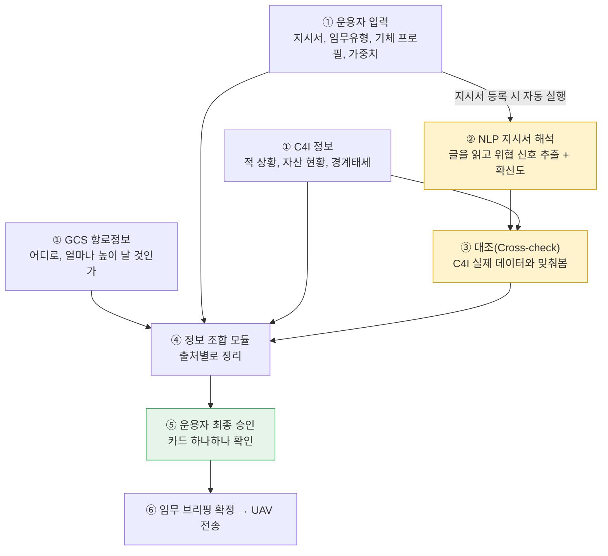

# 4-1 상세 — 지상통제센터 AI는 흩어진 정보를 어떻게 하나의 임무 브리핑으로 만드는가

이 문서는 소개자료 4-1절("지상통제센터 AI — 비행 전, 임무를 정리한다")을 더 자세히 풀어쓴 문서입니다. UAV가 이륙하기 전, 서로 다른 곳에서 들어오는 정보가 어떤 과정을 거쳐 "임무 브리핑" 하나로 확정되는지를 단계별로, 실제 예시 숫자와 함께 따라갑니다.

## 0. 전체 그림 먼저

노란 박스(NLP·대조)가 "AI가 판단 재료를 다듬는" 구간이고, 초록 박스(운용자 승인)가 "사람이 최종 결정하는" 구간입니다. 이 문서 전체를 관통하는 원칙은 하나입니다.

> **AI는 판단 재료를 더 정확하게 만들어줄 뿐, 최종 결정은 항상 사람이 합니다.**

아래에서는 팀이 실제로 쓰는 예시 시나리오 하나("OO여단 정찰중대, 기러기 작전지역, 예비기체 없음")를 처음부터 끝까지 따라가면서 각 단계를 설명합니다.

---

## 1. 정보 수집 — 세 군데서 동시에 모입니다

지상통제센터 AI에 정보를 주는 곳은 서로 관계없는 세 시스템입니다. 한 곳이 끝나야 다음이 시작되는 게 아니라, 세 곳이 동시에 각자 준비되는 대로 정보를 보냅니다. 실제로 이 세 시스템은 서로 다른 조직·장비가 운영하기 때문에, 서로를 기다릴 이유가 없습니다.

| 출처 | 무엇을 주나 | 우리 예시 |
|---|---|---|
| **GCS 항로정보** | 이륙지점, 목표지점(감시 위치), 경유점, 그리고 원기지·전진기지·비상착륙점 같은 복귀 후보지 목록 | 기러기 작전지역까지의 경로와 경유점, 복귀 가능 기지 목록 |
| **운용자 단말입력** | 부대 지시서(공식 문서), 임무유형, 기체 프로필(정격 체공시간·예비기체 보유여부·탑재 센서), 임무 가치 가중치(은닉성·생존성·정보가치·적시성) | 지시서에 "적 저격조 및 대구경화기 첩보 확인됨", "가용 예비기체 없음" 기재. 기체 프로필에 "예비기체 없음" 등록. 이번엔 생존성보다 정보가치를 더 중요하게 가중치 설정 |
| **C4I 정보** | 적 활동 현황, 경계태세(워치콘/데프콘/인포콘), 자산관리체계(예비기체 현황), 민간 밀집도 초안 | 같은 적 첩보를 독립적으로 자동 전송, 자산관리체계에도 "예비기체 없음" 기록 |

여기서 "임무 가치 가중치"는 이 시스템 전체의 철학("최적은 생존이 아니라 임무 성공에 대한 기여도로 정의된다")을 사람이 직접 숫자로 못박는 지점입니다. 같은 상황이라도 이 가중치가 다르면, 뒤에서 이어지는 온보드 엔진의 위험 평가·대응 판단 결론이 달라집니다.

기체 프로필은 임무정보와 따로 관리됩니다. 기체 스펙(정격 체공시간, 예비기체 보유여부, 탑재 장비)은 임무 시작 시 한 번 정해지면 비행 중 바뀌지 않는 **상수**이고, 임무정보(적 상황, 우리 위치, 남은 배터리 등)는 상황에 따라 계속 갱신되는 **변수**이기 때문에 이 둘을 섞지 않습니다.

---

## 2. NLP 지시서 해석 — 글을 읽고 신호로 바꿔줍니다

운용자가 지시서를 등록하는 순간, 백그라운드에서 NLP(문서를 읽는 AI)가 그 글을 읽습니다. "적 저격조 및 대구경화기 첩보 확인됨"이라는 문장을 읽으면, 이걸 "근접 위협 신호가 있고, 상당히 확실하다"는 판단 후보로 바꿉니다.

문장의 표현 강도에 따라 확신도(confidence)가 다르게 매겨집니다. "확인됨"처럼 단정적인 표현이면 확신도가 높게(예: **0.85**), "가능성 있음"처럼 애매한 표현이면 낮게 잡힙니다.

여기서 중요한 규칙이 하나 있습니다. **확신도가 0.7 미만인 신호는 운용자 화면에 아예 보여주지 않습니다.** 확실하지 않은 걸 굳이 승인받으라고 하면 오히려 혼란만 주기 때문입니다. 예를 들어 지시서에 "인근에 무장세력이 있을 수도 있음" 같은 모호한 문장이 있어서 확신도가 0.55로 낮게 나왔다면, 이 신호는 대조 단계로 넘어가지도 않고 조용히 걸러집니다.

또 하나 중요한 설계 원칙: **NLP는 지시서 원문만 읽습니다.** C4I나 GCS가 준 다른 정보는 이 단계에서 함께 보지 않습니다. AI가 여러 데이터를 한꺼번에 뒤섞어 판단하면 나중에 "왜 이런 결과가 나왔는지" 사람이 추적하기 어려워지기 때문입니다. 여러 정보를 종합하는 일은 다음 단계(③ 대조)에서, 계산식이 분명한 방식으로 따로 처리합니다.

**우리 예시**: "적 저격조 및 대구경화기 첩보 확인됨" → 근접 위협 신호, 확신도 **0.85**로 추출. "가용 예비기체 없음" → 재보급 관련 심각도 신호로 추출.

---

## 3. 대조(Cross-check) — AI·운용자 입력을 사실과 맞춰봅니다

NLP가 뽑아낸 신호와 운용자가 직접 등록한 값을, C4I가 자동으로 보내온 실제 데이터와 맞춰보는 단계입니다. 두 종류로 나뉩니다.

### 3-1. 확신도를 조정하는 4종 — "같은 얘기가 다른 경로로도 확인됐는가"

같은 내용이 다른 출처에서도 독립적으로 확인되면, 확신도를 **+0.05만큼 올립니다**(최대 1.0). 반대로 낮추는 경우는 없습니다 — 확인이 안 됐다고 해서 처벌하지 않고, 확인이 될 때만 보너스를 주는 방식입니다.

| 대조 대상 | 무엇과 비교하나 |
|---|---|
| 지시서의 적 활동 관련 위협 신호 | C4I 적상황 정보(enemy_tracks) |
| 지시서의 무기·화력 관련 심각도 신호 | C4I 적상황 정보 |
| 지시서의 예비기체·재보급 관련 심각도 신호 | 기체 프로필의 예비기체 보유여부 |
| 지시서의 민간 지역 관련 신호 | C4I 민간 밀집도 초안 |

**우리 예시**: NLP가 뽑아낸 "적 저격조" 신호(확신도 0.85)를 C4I의 적상황 정보와 대조해보니, C4I도 독립적으로 "적 저격조 활동" 트랙을 잡고 있었습니다. 같은 내용이 서로 다른 두 경로(지시서 문장 ↔ C4I 자동 피드)에서 확인된 것이므로, 확신도가 **0.85 → 0.90**으로 올라갑니다. 승인 화면에는 "C4I 적상황 확증: '적 저격조 활동'"이라는 이유가 함께 표시됩니다.

### 3-2. 일치/불일치만 표시하는 2종 — "확률이 아니라 맞다/틀리다의 문제"

아래 두 항목은 "얼마나 위험한가" 같은 확률 문제가 아니라 "맞다/틀리다" 같은 사실 확인 문제라서, 확신도를 올리고 내리는 대신 불일치 여부만 경고로 보여줍니다.

| 대조 대상 | 무엇과 비교하나 |
|---|---|
| 지시서의 임무목적 | 운용자가 고른 임무유형, C4I의 임무 정보 |
| 기체 프로필의 예비기체 보유여부(운용자 등록) | C4I 자산관리체계 자동 데이터 |

**우리 예시**: 운용자가 기체 프로필에 등록한 "예비기체 없음"을 C4I 자산관리체계 기록과 대조합니다. 두 기록이 일치하면 별다른 경고 없이 그대로 확정되고, 만약 C4I 기록에는 "예비기체 1대 보유"로 나와 있다면 "등록값이 C4I 기록과 다릅니다"라는 경고가 운용자에게 표시됩니다 — 사람이 실수로 잘못 등록했을 가능성을 잡아주는 절차입니다.

참고로 GCS 항로정보(경로)는 이 대조 대상에 들어가지 않습니다. 지시서 문장이 특정 지리적 위치를 콕 집어 언급하지 않는 이상 비교할 대상이 마땅치 않기 때문입니다.

---

## 4. 정보 조합 모듈 — 한 곳에 모아 정리합니다

이제 GCS 항로정보, 운용자가 넣은 정보(지시서·임무유형·기체 프로필·가중치), C4I 정보, 대조까지 끝난 NLP 신호, 이 네 가지를 하나로 묶습니다. 뒤죽박죽 섞지 않고 "이건 GCS에서 왔다", "이건 C4I에서 왔다"처럼 출처별로 정리합니다.

이 시점에 정보 전체가 여섯 그룹으로 재정리됩니다(팀이 확정한 공식 상태 모델 기준). 어렵게 들리지만 각 그룹이 답하는 질문은 단순합니다.

| 그룹 | 쉬운 뜻 | 우리 예시 |
|---|---|---|
| 임무(Mission) | 이번 임무는 뭘 하려는 건가, 뭘 더 중요하게 볼 건가 | 정찰 임무, 정보가치 가중치 높게 |
| 적(Enemy) | 적이 어디서 뭘 하고 있다고 파악됐나 | 적 저격조 활동 트랙(확신도 0.90) |
| 지형(Terrain) | 어디로, 어떤 회랑(경로 폭·고도범위) 안에서 날 것인가 | 기러기 작전지역 경로·회랑 |
| 우리 상태(Troops) | 우리 기체 상태와 복귀 가능한 기지는 어디인가 | 예비기체 없음, 복귀 후보 기지 목록 |
| 시간(Time) | 지금까지 얼마나 지났고, 얼마나 더 버틸 수 있나 | 임무 시작 전이라 아직 0 |
| 민간 요소(Civil) | 비행 금지 구역과 민간 밀집도는 어떤가 | 민간 밀집도 낮음 |

기체 프로필(정격 체공시간·예비기체 보유여부 같은 상수)은 이 여섯 그룹과 따로, 최상위에 별도로 둡니다. 상수와 변수를 섞지 않는다는 원칙을 여기서도 그대로 지킵니다.

---

## 5. 운용자 최종 승인 — 사람이 마지막으로 확인합니다

승인은 두 가지로 나뉩니다.

1. 수집된 정보 전체를 소스별로 요약한 체크리스트를 보고 확인
2. NLP가 제안한 위협 신호들을 카드 형태로 하나하나 확인

카드에는 원래 지시서 문장, NLP의 해석, 확신도, 그리고 대조 단계에서 왜 그 확신도가 나왔는지("C4I 적상황 확증" 같은 이유)까지 전부 표시됩니다. **AI는 여기까지만 관여합니다.** 카드를 실제로 승인할지는 전적으로 사람의 몫이고, 지금 설계에서는 승인 버튼만 다루며 거부·재수집 요청 흐름은 범위 밖으로 남겨뒀습니다.

**우리 예시**: 운용자는 "적 저격조 신호(확신도 0.90, 이유: C4I 적상황 확증)" 카드와 "예비기체 없음 확인(C4I 자산관리체계와 일치)" 카드를 확인한 뒤 승인합니다.

---

## 6. 임무 브리핑 확정 · UAV 전송

승인이 끝나면 이 시점의 정보 전체가 "임무 브리핑(mission_brief)"이라는 이름으로 확정되고, 시간이 기록된 뒤 UAV로 전송됩니다. UAV는 이걸 들고 비행을 시작하고, 온보드 엔진은 이 브리핑에 담긴 임무 성격·가중치·복귀 기지 목록 등을 매 사이클 위험 판단의 입력값으로 그대로 사용합니다(자세한 내용은 4-2 문서 참고).

비행이 끝난 뒤에는 실제로 무슨 일이 있었는지가 별도의 학습 파이프라인으로 흘러가서, 다음 임무 때 NLP가 확신도를 판단하는 데 참고자료로 쓰입니다.

---

## 7. 전체 흐름 한 줄 요약

> GCS·운용자·C4I 세 곳에서 동시에 정보가 들어옴
> → 운용자가 등록한 지시서를 NLP가 읽고 위협 신호 후보를 확신도와 함께 추출(0.85)
> → C4I 실제 데이터와 대조해 같은 내용이 확인되면 확신도 상향(0.85→0.90), 사실 확인 항목은 일치 여부만 표시
> → 모든 정보를 출처별로 정리해 하나의 상태표로 조합
> → 운용자가 카드 하나하나를 근거와 함께 확인하고 승인
> → 임무 브리핑으로 확정되어 UAV(온보드 엔진)로 전송

이 과정에서 AI가 하는 일은 "정보를 더 정확하게 다듬어 사람에게 보여주는 것"까지입니다. 무엇을 승인하고 무엇을 임무 브리핑에 넣을지는 처음부터 끝까지 사람의 결정이고, 이 원칙은 이후 온보드 엔진이 아무리 빠르게 반복 판단을 하더라도 임무 시작 전 단계에서는 그대로 유지됩니다.
