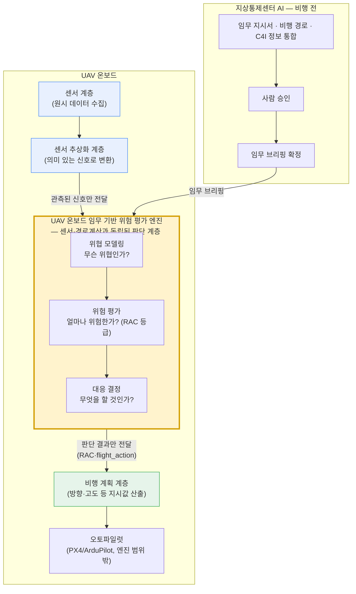

# UAV 온보드 임무 기반 위험 평가 엔진 소개

## 0. 한 줄 요약

이 엔진은 무인기(UAV)가 비행하는 동안 "지금 이 상황이 얼마나 위험한지"를 실시간으로 계산하고, 그 위험 판단에 따라 UAV가 어떻게 대응할지까지 자동으로 이어주는 **임무기반 위험평가 엔진**입니다. 경로를 최적화해주는 프로그램이 아니라, 위험을 판단하는 프로그램입니다.

---

## 1. 위험평가란 무엇인가

"위험평가"라고 하면 어렵게 들리지만, 개념은 단순합니다.

> **위험 = 어떤 나쁜 일이 일어날 가능성 × 그 일이 실제로 일어났을 때의 피해 크기**

예를 들어 "적이 근처에 있을 확률이 얼마나 되고, 만약 그게 사실이라면 UAV나 임무에 얼마나 큰 피해가 생기는가"를 같이 따져서 등급을 매기는 것입니다. 확률만 높고 피해가 작으면 낮은 위험, 확률은 낮아도 피해가 치명적이면 높은 위험으로 분류됩니다.

여기서 중요한 점이 하나 있습니다. 위험은 한 번 계산하고 끝나는 고정된 숫자가 아니라, **그 순간의 상황에 따라 계속 바뀌는 값**입니다. 5분 전에는 안전했던 경로가 지금은 위험할 수 있고, 지금 위험한 지역도 10분 뒤에는 다시 안전해질 수 있습니다.

이건 저희가 이번에 새로 만든 개념이 아닙니다. 미군은 이미 수십 년 전부터 작전 중 위험을 판단하는 절차를 공식 교리로 운용해왔고, 2006년 야전 교범부터 위험 관리를 작전 절차 안에 포함시켰습니다. 지금은 합동참모본부 차원에서도 위험 분석을 "작전 실행 중 의사결정을 돕는 도구"로 명시하고, 그 방법론을 계속 다듬어오고 있습니다. 즉 위험평가는 군사 작전에 오랫동안 축적되어 온 검증된 프레임워크이고, 저희는 이 프레임워크를 UAV 임무에 맞게 옮겨온 것입니다.

---

## 2. 왜 하필 "임무 기반" 위험평가인가

UAV 관련 시스템들은 대부분 "어떻게 하면 기체가 살아남을까"에 초점을 맞춥니다. 지형지물을 인식해서 장애물을 피하고, 위협을 감지하면 회피기동을 하는 식입니다. 이건 틀린 접근은 아니지만, 딱 절반짜리 접근입니다.

군 교리는 위험을 처음부터 두 개의 서로 다른 축으로 나눕니다.

- **Risk to Force**: 기체(전력)를 안전하게 보존할 수 있는가
- **Risk to Mission**: 애초에 하려던 임무를 완수할 수 있는가

지형지물을 피해 살아남는 것은 이 중 Risk to Force 하나만 다루는 것입니다. 그런데 실제 작전에서는 "적이 확인된 상황에서 정찰을 계속 밀어붙일지, 여기서 포기하고 돌아갈지"처럼 지형과 아무 상관없는 판단이 훨씬 더 중요할 때가 많습니다. 미 육군 교리도 위험 관리를 "위험 비용과 임무 이익을 저울질하는 과정"이라고 정의합니다. 즉 위험을 0으로 만드는 게 목표가 아니라, 위험을 감수하고서라도 임무를 완수할 가치가 있는지를 판단하는 게 진짜 목표입니다.

그래서 저희는 질문을 이렇게 바꿨습니다.

> "이 상황에서 기체가 안전한가?"가 아니라, **"이 상황에서 임무를 계속하는 게 맞는가?"**

**최적은 생존이 아니라 임무 성공입니다.** 이 기준 하나가 저희 시스템 전체(위협 판단 → 위험 등급화 → 자동 대응 → 비행 지시)를 관통합니다.

---

## 3. 위험평가는 언제 해야 하는가 — 한 번이 아니라 계속

위험이 "그 순간의 상황"에 묶인 판단이라면, 답은 명확합니다. **비행 내내, 계속, 실시간으로** 다시 평가해야 합니다.

UAV는 특히 더 그렇습니다. 배터리는 시간이 지나면서 줄어들고, 통신 품질은 지형과 거리에 따라 수시로 변하고, 위협은 몇 초 만에 나타났다 사라집니다. 5분 전 위험 판단을 그대로 믿고 비행하면, 이미 상황이 바뀐 뒤에 반응하게 됩니다. 너무 이르게 판단하면 정보가 부족해서 틀리고, 너무 늦게 판단하면 대응할 시간이 없어서 틀립니다. 그래서 군 교리에서도 위험 판단은 계획 단계 한 번으로 끝나는 게 아니라 "실행 중의 의사결정"까지 계속 지원해야 한다고 못 박고 있습니다.

사람이 매초 이 판단을 새로 내릴 수는 없습니다. 그래서 이 반복 판단을 기계가 대신 수행하고, 사람은 중요한 결정의 순간에만 개입하는 구조가 필요합니다. 이 엔진이 바로 이 역할을 합니다.

---

## 4. 전체 시스템은 지상통제센터 AI와 온보드 엔진, 두 축으로 구성됩니다

전체 시스템은 크게 **지상통제센터 AI**와 **온보드 엔진**, 두 축으로 나뉩니다. 역할을 아주 단순하게 비유하면, 지상통제센터 AI는 "출발 전 브리핑을 준비하고 정리해주는 참모"이고, 온보드 엔진은 "비행 내내 옆에서 상황을 계속 판단해주는 관제사"입니다.

### 4-1. 지상통제센터 AI — 비행 전, 임무를 정리한다

> 📄 더 자세한 동작 원리는 [4-1 상세자료](./4-1-지상통제센터-AI-동작원리.md)에서 볼 수 있습니다.

UAV가 뜨기 전, 서로 다른 세 곳에서 들어오는 정보를 동시에 모읍니다.

- 지상통제장비(GCS)로부터 실제 비행 경로
- 운용자 단말로부터 사람이 작성한 임무 지시서
- 지휘통제통신체계(C4I)로부터 현재 적 상황·가용 자산 정보

이 중 임무 지시서는 사람이 자유롭게 쓴 문장이기 때문에, AI가 이 글을 읽고 "이 위협은 이 정도로 심각해 보인다"는 판단 후보를 뽑아냅니다. 다만 이 판단을 그대로 믿지 않고, C4I로 들어온 실제 상황 정보와 서로 맞춰봅니다. 같은 내용이 다른 경로로도 확인되면 신뢰도를 높이고, 서로 어긋나면 그 사실을 그대로 운용자에게 보여줍니다.

이렇게 정리된 정보는 운용자에게 요약으로 제시되고, 운용자는 AI가 제안한 판단들을 하나씩 근거를 보며 승인합니다. 이 승인을 거쳐야만 비로소 "임무 브리핑"이 확정되어 UAV로 전달됩니다. **AI는 판단 재료를 다듬어주는 역할까지만 하고, 실제 결정은 항상 사람이 내립니다.** 그리고 임무가 끝난 뒤에는 실제로 무슨 일이 있었는지를 학습 파이프라인으로 축적해서, 다음 임무 때 AI가 더 정확하게 판단하도록 업데이트합니다.

### 4-2. 온보드 엔진 — 비행 중, 위험을 계속 판단한다

> 📄 더 자세한 동작 원리는 [4-2 상세자료](./4-2-온보드-엔진-동작원리.md)에서 볼 수 있습니다.

여기가 UAV 온보드 임무 기반 위험 평가 엔진의 핵심입니다. 온보드 엔진은 여러 센서로부터 들어오는 정보와 지상통제센터가 전달한 임무 브리핑을 조합해, 비행 내내 "지금 위험한 상황인가, 위험하다면 어떻게 대응할 것인가"를 반복해서 계산합니다. 이 과정은 6개 계층이 하나의 사이클처럼 순서대로 돌아갑니다.

1. **센서 계층**: 카메라, GPS, 통신 상태, 배터리, 소리, 지형, 임무 진행 상황 등 원시 데이터를 수집합니다.
2. **센서 추상화 계층**: 원시 데이터를 "지금 근처에 사람이 있다", "GPS 신호가 이상하다"처럼 의미 있는 신호로 정리합니다.
3. **위협 모델링 계층**: 정리된 신호를 보고 "지금 어떤 종류의 위협이 있는지, 얼마나 확실한지, 위협이 어느 단계까지 진행됐는지"를 판정합니다. (예: 근접 위협, GPS 스푸핑, 사이버 하이재킹, 지형충돌 등)
4. **위험 평가 계층**: 판정된 위협 각각에 대해 "발생 가능성 × 피해 크기"를 계산해 위험 등급(낮음/보통/심각/높음)을 매기고, 여러 위협이 동시에 떴을 때 어느 것부터 대응해야 하는지 우선순위를 정합니다.
5. **대응 계층**: 가장 급한 위협 하나를 골라, 실제로 뭘 할지(회피할지, 고도를 올릴지, 통신량을 줄일지, 기지로 돌아갈지)를 결정합니다.
6. **비행 계획 계층**: 위 결정을 실제 비행 지시값(어느 방향으로, 얼마나, 국소 조정인지 전체 경로 재계산인지)으로 바꿔서 오토파일럿에 넘깁니다.

이 6단계가 비행 내내 사이클마다 반복됩니다. 위험 등급을 실제로 매기는 계산(3~4단계)은 정해진 표를 그대로 조회하는 결정론적 방식이라, AI가 임의로 값을 바꾸지 못합니다. AI 강화 판단은 옆에서 참고 지표로만 보조하고, 최종 등급과 최종 의사결정 권한은 항상 정해진 규칙과 사람에게 있습니다.

---

## 5. 아키텍처 — 센서, 위험 평가, 경로 계산은 서로 다른 계층입니다

6단계를 한 덩어리로 보면 "결국 센서로 데이터 모아서 경로 짜는 파이프라인" 정도로 오해하기 쉽습니다. 하지만 실제 구조를 뜯어보면 세 부분은 **서로 완전히 독립된 계층**이고, 그중 가운데(위협 모델링 → 위험 평가 → 대응 결정)가 바로 이 엔진의 본체입니다.

- **센서 계층 / 센서 추상화 계층**: 카메라·GPS·통신·배터리 등 "무엇이 관측되었는가"만 다룹니다. 위험이 얼마나 큰지는 판단하지 않습니다.
- **임무 기반 위험 평가 엔진 (위협 모델링 → 위험 평가 → 대응 결정)**: 관측된 신호를 받아 "이게 위협인가, 얼마나 위험한가, 뭘 해야 하는가"만 판단합니다. 센서가 데이터를 어떻게 수집하는지, 경로가 어떻게 계산되는지는 전혀 알지 못하고 알 필요도 없습니다.
- **비행 계획 계층**: 위 판단(예: "회피하라", "고도를 올려라")을 받아서 실제 좌표·방위각 같은 경로 계산으로 옮깁니다. 위험이 얼마나 큰지는 판단하지 않고, 이미 내려진 결정을 실행 가능한 지시값으로 바꾸는 역할만 합니다.

즉 이 엔진은 "센서가 이렇게 생겼으니까", "경로를 이런 알고리즘으로 짜니까" 존재하는 게 아니라, 그 둘과 무관하게 독립적으로 동작하는 판단 계층입니다. 센서나 경로 계산 방식이 통째로 바뀌어도, 이 엔진의 위험 판단 로직 자체는 그대로 유지됩니다.

그림에서 노란 박스(임무 기반 위험 평가 엔진)만 따로 떼어놓아도 완전히 동작합니다. 파란 박스(센서)는 "무엇을 관측했는가"만 넘겨주고, 초록 박스(비행 계획)는 "그래서 좌표를 어떻게 바꿀 것인가"만 계산합니다. 위험을 판단하는 로직은 이 두 박스 어디에도 들어있지 않고, 오직 노란 박스 안에만 존재합니다.

---

## 6. UAV의 비행 준비부터 비행 후까지, 전체 흐름

정리하면 이 엔진은 UAV 임무의 시작부터 끝까지 한 줄로 이어집니다.

**① 비행 준비 (지상통제센터 AI)**
운용자의 임무 지시서, 비행 경로, 실시간 적 정보를 모아 AI가 정리하고, 사람이 승인해서 임무 브리핑을 확정합니다.

**② 이륙 및 비행 (온보드 엔진)**
UAV가 임무 브리핑을 들고 이륙하면, 온보드 엔진이 센서 → 위협 판단 → 위험 등급화 → 대응 결정 → 비행 지시까지의 6단계를 매 순간 반복합니다. 상황이 바뀔 때마다(위협 등장, 위협 해소, 임무 단계 전환) 즉시 다시 판단합니다.

**③ 상황 대응**
위험이 낮으면 원래 경로를 유지하고, 위험이 높아지면 고도를 올리거나 경로를 우회하거나 필요하면 임무를 중단하고 복귀합니다. 이 판단은 "기체가 안전한가"가 아니라 "임무를 계속할 가치가 있는가"를 기준으로 내려집니다.

**④ 비행 종료 및 학습**
임무가 끝나면 실제로 무슨 일이 있었는지가 지상통제센터로 다시 모여 학습 데이터로 축적되고, 다음 임무 때 AI의 판단 정확도를 높이는 데 쓰입니다.

이 전체 흐름에서 사람이 완전히 배제되는 순간은 없습니다. 임무 확정은 사람이 승인하고, 비행 중 즉각 대응은 정해진 규칙에 따라 기계 속도로 처리하되, 판단 근거는 항상 추적 가능하게 남고, 더 큰 결정(임무 지속 여부 등)에는 사람이 개입할 여지를 둡니다.

---

## 7. 다시 한번 강조: 경로 최적화 프로그램이 아니라, "다시 계산할지"를 판단하는 엔진입니다

이 엔진을 보고 "결국 최적 경로를 계산해주는 시스템 아니냐"고 생각하기 쉽습니다. 하지만 5장의 다이어그램에서 봤듯 순서와 구조가 다릅니다.

이 엔진은 좌표나 경로 자체를 계산하지 않습니다. 대신 "지금 경로를 다시 짜야 할 만큼 위험한 상황인가, 그렇다면 어떤 방식으로 대응해야 하는가"를 판단하고, 그 판단 결과(위험 등급, 우선순위, 대응 방식 같은 근거값)를 뒤에 있는 비행 계획 계층에 넘겨줄 뿐입니다. 실제 경로 재계산과 좌표 최적화는 이 근거값을 받은 비행 계획 계층(및 오토파일럿)이 수행합니다.

즉 이 엔진의 역할은 "경로를 최적화하는 것"이 아니라, **"경로 최적화를 다시 수행해야 할지, 필요하다면 어떤 방향으로 해야 할지를 판단하는 근거값을 전달하는 것"**입니다.

그래서 한마디로 정의하면 이렇습니다.

> **이 엔진은 경로를 직접 최적화하는 프로그램이 아니라, 경로 최적화를 재수행할지 판단하는 근거값을 전달하는 UAV 온보드 임무 기반 위험 평가 엔진입니다.**

경로 재계산은 이 근거값을 받은 뒷단이 수행하는 별개의 계산이고, 이 엔진의 진짜 가치는 "지금 이 임무를 계속할 것인가, 경로를 바꿔야 할 만큼 위험한가"를 매 순간 정확하게 판단하는 데 있습니다.
